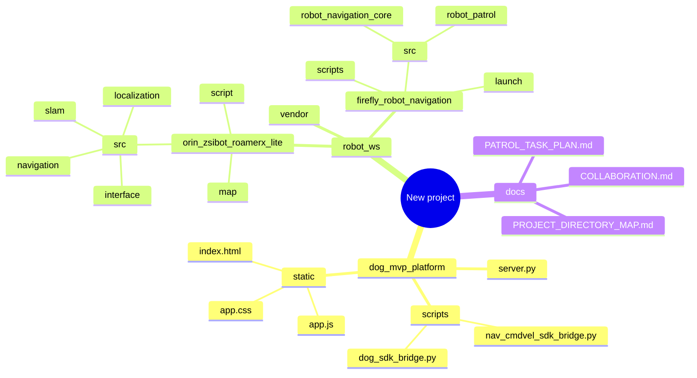

# Project Directory Map

This repo is split into three working layers:

- `dog_mvp_platform/`: web control panel and backend bridge.
- `robot_ws/orin_zsibot_roamerx_lite/`: Orin-side ROS2 stack for SLAM, localization, navigation, and patrol.
- `robot_ws/firefly_robot_navigation/`: Firefly-side experimental navigation and patrol code.
- `robot_ws/vendor/`: third-party dependencies and vendor snapshots, not for day-to-day edits.

## Where To Work

- SLAM and map saving: `robot_ws/orin_zsibot_roamerx_lite/src/slam/`
- Localization: `robot_ws/orin_zsibot_roamerx_lite/src/localization/`
- Navigation core: `robot_ws/orin_zsibot_roamerx_lite/src/navigation/`
- Patrol task logic: `robot_ws/orin_zsibot_roamerx_lite/src/navigation/` or a new `park_patrol` package under that tree
- Web UI and API: `dog_mvp_platform/`
- Early testing and lower-level experiments: `robot_ws/firefly_robot_navigation/`

## Recommended Editing Rule

Keep vendor code, generated build folders, logs, and map artifacts out of normal edits. Main feature work should stay in the Orin workspace and the web control layer.
