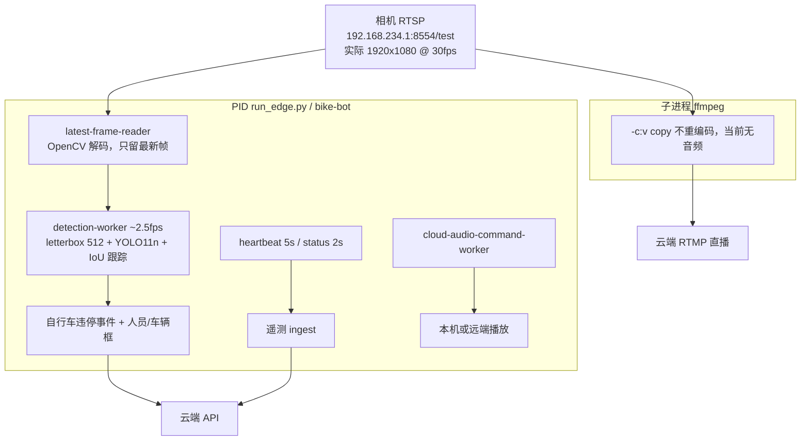

# 板端 YOLO 检测 CPU 瓶颈与 GPU/TensorRT 优化计划

更新时间：2026-08-22

本文件给同事讨论确认，确认后原样交给执行代理落地。未完成第 0 节拍板前，**不要改代码、不要改 systemd、不要重启检测服务**。

执行进度记在 [YOLO_GPU_INFERENCE_EXECUTION.md](YOLO_GPU_INFERENCE_EXECUTION.md)。链路背景见 [platform/docs/edge-and-video-pipeline.md](../platform/docs/edge-and-video-pipeline.md)。

## Summary

NX 上的 `run_edge.py` 是自行车违停检测边端，不是内存泄漏。`ps -ef` 里的 `99` 是 CPU。YOLO 会话已经挂了 CUDA，但整帧检测仍约 2.5fps、每帧 360–560ms，GPU 几乎空闲。根因是：没用 TensorRT、CUDA EP 对 YOLO11 大量回落到 CPU、后处理用 Python 扫全部候选框、实际按 1080p 解码，且 systemd 把该进程限制在两核。

推荐最小改动：**NumPy 向量化后处理 + TensorRT FP16**。直播链路保持 `-c:v copy`，检测框不画进直播。

## 0. 拍板清单（执行前必填）

同事讨论后把选项改成明确选择。执行代理只实现已勾选且已选定的项；未勾选视为本轮不做。

| ID | 决策 | 选项 | 结论 |
|---|---|---|---|
| D1 | 改哪份代码 | A. 只改正在跑的 `platform/bot-version-test`（推荐） / B. 同时改 `platform/bot-version` | 待定 |
| D2 | 推理后端 | A. 只向量化后处理，继续 CUDA EP / B. TensorRT FP16 + CUDA 兜底 + 向量化后处理（推荐） / C. 先 B，现场失败再回退 A | 待定 |
| D3 | 检测目标帧率 | A. 8–12fps 即可（推荐） / B. 尽量接近 30fps / C. 固定每秒 N 帧，N=____ | 待定 |
| D4 | 输入分辨率 | A. 本轮不改，仍跟相机 1080p（推荐先做推理） / B. 解码后立即缩到 1280×720 / C. 改相机 RTSP 输出分辨率 | 待定 |
| D5 | TensorRT engine 缓存目录 | 默认 `/home/dogrobot/runtime/nx-edge/data/cache/roamerx/yolo11n` | 待定 |
| D6 | 与 SenseVoice 共用 GPU | A. 共存，YOLO 用 TRT FP16（推荐） / B. 检测时段停语音 GPU / C. 语音改 CPU | 待定 |
| D7 | systemd `CPUQuota=200%` | A. 先不改，用优化后的 CPU 占用再决定（推荐） / B. 优化后降到 100% / C. 取消配额 | 待定 |
| D8 | 检测框是否画进直播 | A. 不画，直播继续 copy（推荐，保持现状） / B. 本轮改成叠加框后重编码 | 待定 |
| D9 | 现场验证窗口 | 允许短暂重启 `roamerx-bike-bot`；首次 TensorRT 编 engine 可能 2–10 分钟 | 待定 |

默认推荐组合（若讨论后无异议可直接采用）：**D1=A, D2=B, D3=A, D4=A, D5=默认路径, D6=A, D7=A, D8=A**。

## 1. 问题是怎么回事

### 1.1 现场进程

2026-08-22 20:34 起，NX 上实际在跑：

```text
/usr/bin/python3 /home/dogrobot/platform/bot-version-test/run_edge.py \
  --config /home/dogrobot/runtime/nx-edge/conf/bike-bot.yaml
```

systemd 单元：`platform/bot-version-test/systemd/roamerx-bike-bot.service`。
配置：`runtime/nx-edge/conf/bike-bot.yaml`（机器人 `ZSL-1A-07`，南入口巡检）。

子进程 ffmpeg 把同一路相机 RTSP copy 到云端 RTMP，和检测解码是两条独立链路。

### 1.2 容易看错的指标

`ps -ef` 第 4 列是 CPU，不是内存。当时看到的 `99` 表示 CPU 打满。

| 指标 | 现场值 | 含义 |
|---|---|---|
| `%CPU` | 约 140%（systemd 上限 200%） | 检测环在烧 CPU |
| RSS | 约 640–660MB（4.1%） | 真实物理内存，对 Python+OpenCV+ORT+CUDA context 正常 |
| VSZ | 约 20GB | CUDA 虚拟地址映射，不是真吃了 20GB RAM |
| 线程 | 41 | ORT / OpenCV / 心跳 / 推流 / 音频 |
| ffmpeg RSS | 约 50MB，CPU 约 1.4% | 直播 copy，可忽略 |
| 机器内存 | 15.6GB 中约用 11GB | 该进程不是整机内存元凶 |

看占用请用：

```bash
ps -o pid,%cpu,%mem,rss,vsz,nlwp,cmd -p <pid>
```

### 1.3 「已经在用 GPU」和「推理在 GPU 上跑」不是一回事

启动日志：

```text
loaded ONNX model with onnxruntime: .../yolo11n.onnx
providers=['CUDAExecutionProvider', 'CPUExecutionProvider']
```

板端 `/usr/bin/python3` 的 ORT 1.23.0 实际可用：

```text
['TensorrtExecutionProvider', 'CUDAExecutionProvider', 'CPUExecutionProvider']
device = GPU
```

代码只请求了 CUDA + CPU，**没有用 TensorRT**。`bike-bot.yaml` 里 `model.device: ''` 只对 Ultralytics 后端生效，当前 `backend: onnxruntime` **根本不读这个字段**。

现场 `edge_perf`（`runtime/nx-edge/data/vision/logs/bike-bot.log`）：

- 相机 30fps，1920×1080（配置写的 1280×720 未生效）
- 检测约 **2.5fps**，`avg_detect_ms` **360–560**，峰值超过 1s
- 每 10 秒扔掉 **270+** 帧（`dropping_old_frames_to_keep_latest`）
- `tegrastats` 的 `GR3D_FREQ` 约 **0–27%**

这和 `platform/docs/current-progress-report.md` 里「CPU 推理约 2fps」一致。YOLO11n 在 Orin 上若真正走 TensorRT，通常是十几毫秒量级，不会是半秒一帧。

结论：CUDA 会话在，GPU kernel 很少；**费时的是 CPU 预处理、CUDA EP 算子回落、以及纯 Python 后处理**。

## 2. 当前流程

检测和直播并行，**检测画面不会画到直播里**。



主线程在 `platform/bot-version-test/src/bike_bot/main.py` 拉起：

| 线程 | 作用 |
|---|---|
| `latest-frame-reader` | 拉 RTSP，30fps 解码，只保留最新一帧；检测慢就丢旧帧 |
| `detection-worker` | 对最新帧跑 YOLO；自行车违停告警；按云端开关上报人/车框 |
| `zlm-stream-worker` | 拉起 ffmpeg：RTSP → RTMP copy |
| `heartbeat-worker` / `status-worker` | 定时上报在线状态 |
| `cloud-audio-command-worker` | 轮询云端录音并播放 |
| 控制服务 | 配置里 `control.enable: false`，当前未开 |

检测一帧内部顺序：

1. 等到最新帧（输入经常是 1080p BGR）。
2. `letterbox` 到 `image_size=512`，`blobFromImage` 归一化（CPU / OpenCV）。
3. `onnxruntime.InferenceSession.run()`。provider 顺序是 CUDA → CPU；YOLO11 不少算子 CUDA EP 不支持，会切回 CPU，并带来反复拷贝。
4. `_parse_yolo_predictions()`：对约 5000+ 候选框逐行 `.tolist()`，再对 80 类做 Python `max()`，然后 OpenCV NMS。
5. IoU 跟踪；命中自行车则冷却后抓 JPEG、上报 `vehicle_illegal_parking`。
6. 每秒询问云端人员检测开关。未配独立 `person_model` 时，开启后复用同一个 YOLO 的 `person` 框。
7. 预览窗口关闭（`display.enable: false`）。

systemd 额外限制：`CPUQuota=200%`，所以即使用户看到 140% CPU，也已经被配额卡住，无法用更多核硬扛。

## 3. 根因

按收益排序。P1 和 P2 必须一起做，只做一件帧率都上不去。

### P1 后处理是纯 Python 热循环（必改）

`detector.py` 的 `_parse_yolo_predictions()` 对每个 anchor：

- `prediction.tolist()`（约 84 个 float）
- `max(range(len(class_scores)), key=...)` 扫 80 类

512 输入大约 5000–8400 个框，每帧数十万次 Python 循环，在 ARM 上轻松 200–400ms。即使网络 20ms 跑完，`avg_detect_ms` 仍会停在几百毫秒。

### P2 推理走 CUDA EP，没用 TensorRT

板端有 `libnvinfer.so.10`（TensorRT 10.3），ORT 也暴露了 `TensorrtExecutionProvider`。当前写死：

```python
providers = ["CUDAExecutionProvider", "CPUExecutionProvider"]
```

CUDA EP 对 YOLO11 图划分差，算子回落 + H2D/D2H，GPU 频率上不去。内部文档已把「后续 TensorRT」列为待评估项。

### P3 实际按 1080p 解码

配置 `video.width/height: 1280x720`，日志 `capture_width=1920 capture_height=1080`。RTSP 上 `CAP_PROP_FRAME_WIDTH` 经常无效。letterbox/copy 都在吃 1080p。

### P4 GPU 已被语音占用，但不是主因

`funasr-server --device cuda:0`（SenseVoice）同时在跑。YOLO11n FP16 engine 很小，默认可共存；若 TRT 编 engine 或推理 OOM，再按 D6 处理。

### P5 不是内存泄漏

RSS 稳定在 ~650MB，没有持续爬升迹象。20GB VSZ 是 CUDA 映射。不要按内存泄漏去「优化」。

## 4. 方案

### 方案 A：只向量化后处理

改 `_parse_yolo_predictions()` 为 NumPy：`argmax`、阈值掩码、一次性坐标还原、`cv2.dnn.NMSBoxes`。不改 provider。

- 优点：风险最低，不编 engine，不碰 GPU 调度。
- 缺点：网络部分仍可能在 CPU/CUDA 回落上，帧率可能只到 4–8fps。
- 适用：D2=A，或 TRT 现场失败时的回退。

### 方案 B：TensorRT FP16 + 向量化后处理（推荐）

provider 改为 TensorRT → CUDA → CPU，开 FP16 和 engine 缓存；同时做方案 A。

- 优点：这是板端 ORT 已经具备、改动最小的真 GPU 路径。
- 缺点：首次启动编 engine 2–10 分钟；YOLO11 个别算子仍可能落到 CUDA/CPU，需要看 `get_providers()` 和 `avg_detect_ms`。
- 适用：D2=B。

### 方案 C：B + 降低检测输入分辨率

在 B 之后，解码后 `resize` 到 720p，或改相机 RTSP 分辨率。直播仍可保持 1080p copy（检测和直播是分开拉流的）。

- 优点：减 CPU 解码和 letterbox。
- 缺点：改相机要动 3588/相机端；解码后 resize 要加在 reader，避免误伤直播。
- 适用：D4=B 或 C。本轮推荐先 D4=A。

### 明确不做（除非 D8=B）

- 不要把检测框叠进 RTMP。那会强制重编码，直播延迟和 CPU 都会变差。
- 不要为了「用 GPU」去装 PyTorch。
- 不要把 `model.device: cuda` 当成修复；onnxruntime 路径不读它。
- 不要用 OpenCV DNN CPU 替换当前 ORT。
- 不要在未拍板时改 `CPUQuota` 或停掉 SenseVoice。

## 5. 可执行任务

按顺序做。每项完成后更新执行文档的状态、命令和日志证据。

### P0 固化基线（不改代码）

目的：优化前后能对比。

1. 记录 PID、`ps -o pid,%cpu,%mem,rss,vsz,nlwp`、`CPUQuota`。
2. 从 `bike-bot.log` 取连续 3 条 `edge_perf detection_window` 和 3 条 `latest_frame_reader_window`。
3. 采 3 秒 `tegrastats --interval 1000`，记下 `GR3D_FREQ`、RAM、CPU。
4. 确认：
   ```bash
   /usr/bin/python3 -c "import onnxruntime as ort; print(ort.__version__, ort.get_available_providers(), ort.get_device())"
   ls /usr/lib/aarch64-linux-gnu/libnvinfer.so*
   ```
5. 把基线贴进执行文档。2026-08-22 已测过一版，执行时若进程已重启需重测。

验收：执行文档里有优化前数字。不改任何文件。

### P1 向量化 YOLO 后处理

文件：

- `platform/bot-version-test/src/bike_bot/detector.py`
- 新增 `platform/bot-version-test/tests/test_detector_parse.py`（若 D1=B，对 `bot-version` 做同样改动）

要求：

1. `_parse_yolo_predictions()` 用 NumPy 处理 `[N, 4+C]` 或 `[C+4, N]`，禁止对每个 anchor `.tolist()` + Python `max()`。
2. 置信度阈值、NMS IoU、letterbox 反变换、裁剪到图像边界与现在语义一致。
3. 单类（C=1）和多类（C=80）都要覆盖。
4. 返回的 `RawDetection` 字段不变，跟踪和告警不用改。
5. 单测用合成矩阵：已知框、低于阈值被丢、NMS 去重。不访问相机、不加载真实 ONNX。

验收：

```bash
cd /home/dogrobot/platform/bot-version-test
python3 -m pytest -q tests/test_detector_parse.py
```

通过；现有检测 JSON 字段不变。

### P2 接入 TensorRT provider

仅当 D2=B 或 C。

文件：

- `platform/bot-version-test/src/bike_bot/detector.py`
- `platform/bot-version-test/src/bike_bot/config.py`
- `platform/bot-version-test/config.example.yaml`
- 不要把真实 `device_key` 写进文档或 example。

要求：

1. `backend: onnxruntime` 时 provider 默认：
   ```python
   [
     ("TensorrtExecutionProvider", {
       "device_id": 0,
       "trt_fp16_enable": True,
       "trt_engine_cache_enable": True,
       "trt_engine_cache_path": <config>,
     }),
     "CUDAExecutionProvider",
     "CPUExecutionProvider",
   ]
   ```
2. 缓存目录来自配置，默认 `runtime/nx-edge/data/cache/roamerx/yolo11n`；进程用户 `dogrobot` 可写；启动前 `mkdir -p`。
3. 日志必须打出 `session.get_providers()`，以及 TensorRT 是否成功排在第一位。
4. 可用配置关闭 TensorRT、回退 CUDA EP，便于现场回滚，不必改代码重装。
5. 首次编 engine 允许几分钟；不要因此改 systemd `Type=` 或乱加短超时。
6. 编 engine 失败：打 error、回退 CUDA EP、进程保持在线，不要死循环重启。

验收：重启后日志 `providers=` 以 `TensorrtExecutionProvider` 开头，或明确记录回退原因。缓存目录出现 engine 文件。

### P3 可选：检测输入缩小

仅当 D4=B 或 C。

- D4=B：只在 `LatestFrameCapture` 或 `detect()` 前 resize 检测帧；**不要**改 ffmpeg 命令。
- D4=C：改相机/3588 RTSP 输出，本仓库可能只有文档和验收，不改 YOLO 代码。

验收：`edge_perf video_source_opened` 或新日志给出检测帧 WxH；直播仍是 copy；网站能播。

### P4 性能日志补齐

文件：`detector.py` 和/或 `main.py`。

在现有 `edge_perf detection_window` 上拆出（或新增一行）：

- `preprocess_ms`
- `session_run_ms`
- `parse_ms`
- `providers=`

验收：连续两个 10s 窗口能区分「网络慢」还是「后处理慢」。

### P5 现场验证（需 D9 允许重启）

1. 确认无建图/导航关键任务占用同一块 GPU 到无法分配。
2. 重启 bike-bot（不要顺便重启整个 Edge，除非必须）：
   ```bash
   sudo systemctl restart roamerx-bike-bot
   journalctl -u roamerx-bike-bot -n 80 --no-pager
   tail -n 50 /home/dogrobot/runtime/nx-edge/data/vision/logs/bike-bot.log
   ```
3. 等首次 engine 编译结束（若 P2 执行了）。
4. 再采 P0 同一组数字。
5. 看网站直播是否仍在播；抽一次自行车框/违停事件，确认没有把所有目标报成同一类。
6. 看 SenseVoice 是否仍占用 `cuda:0`、有无 OOM。

通过标准（按 D3，推荐 D3=A）：

| 项 | 优化前基线 | 通过线 |
|---|---|---|
| `avg_detect_ms` | 360–560 | D3=A：稳定 < 80ms；D3=B：稳定 < 40ms |
| `effective_fps` | ~2.5 | D3=A：≥ 8；D3=B：≥ 20 |
| `dropped_frames` / 10s | ~270 | 明显下降，与 fps 提升相符 |
| `GR3D_FREQ` | 0–27% | 检测期间明显高于基线 |
| RSS | ~650MB | 不持续爬升；允许因 TRT 增加一两百 MB |
| 直播 | copy 正常 | 仍 copy，无新增重编码 |
| 告警语义 | 自行车违停 | 类别、跟踪 ID、冷却行为与改前一致 |

任一不通过：按第 6 节回滚，把日志片段写入执行文档，停止继续加功能。

### P6 文档同步

同一轮改动更新：

- 本计划不必改结论，只改「已拍板」引用
- 执行文档填结果
- `platform/docs/edge-and-video-pipeline.md` 补一句：onnxruntime 默认 TensorRT（若已做）、检测与直播仍分离
- 不要把密钥、公网 IP 口令写入文档

## 6. 回滚

1. 配置关闭 TensorRT（P2 提供的开关），重启 `roamerx-bike-bot`。
2. 若无开关：把 `detector.py` 的 providers 恢复为 `["CUDAExecutionProvider", "CPUExecutionProvider"]`。
3. 向量化后处理可保留：它不依赖 GPU，CPU 路径也更快。
4. 删除损坏的 engine 缓存后再编：
   ```bash
   rm -rf /home/dogrobot/runtime/nx-edge/data/cache/roamerx/yolo11n
   ```
5. 不要 `git push --force`，不要改 git config。

## 7. 执行代理约束

拿到本文件开始改代码时：

1. 先读第 0 节。D1–D8 仍是「待定」则停止，只回复缺哪些结论。
2. 只改第 5 节列出的文件。D1=A 时不要同步改 `bot-version`。
3. 不要提交，除非用户明确要求。
4. 不要把 `bike-bot.yaml` 里的密钥写进代码或文档。
5. 不要改直播 ffmpeg 参数，除非 D8=B。
6. 不要为验证去启动运动、建图或充电。
7. 现场重启前确认 D9 已允许。
8. 每完成一项，更新 `YOLO_GPU_INFERENCE_EXECUTION.md`：状态、命令、关键日志、是否达到第 5 节通过线。

## 8. 关键代码与配置锚点

| 路径 | 为什么重要 |
|---|---|
| `platform/bot-version-test/src/bike_bot/detector.py` | 加载 ORT、CUDA provider、Python 后处理循环 |
| `platform/bot-version-test/src/bike_bot/main.py` | 读帧、检测、丢帧、推流线程 |
| `platform/bot-version-test/src/bike_bot/stream.py` | ffmpeg RTSP→RTMP copy |
| `platform/bot-version-test/systemd/roamerx-bike-bot.service` | `CPUQuota=200%`，ExecStart 指向 test 树 |
| `runtime/nx-edge/conf/bike-bot.yaml` | 现场配置；`backend: onnxruntime`，`image_size: 512` |
| `runtime/nx-edge/install/models/yolo11n.onnx` | 当前模型，约 11MB |
| `runtime/nx-edge/data/vision/logs/bike-bot.log` | `edge_perf` 基线 |
| `runtime/nx-edge/data/cache/roamerx` | 已规划的 TRT/ONNX 缓存根目录 |
