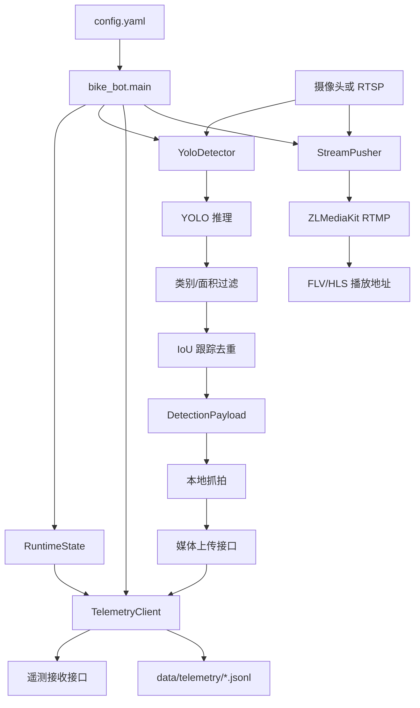

# bot-version 项目结构与实现分析

[返回文档中心](./project-docs-index.md)

## 1. 项目定位

`bot-version` 是机器人板端检测与上报程序，面向机器狗或边缘计算板部署。它把摄像头或 RTSP 视频源转换为平台可消费的实时状态、AI 检测事件、抓拍图片和播放流地址。

当前项目聚焦一个最小闭环：

- 读取本地摄像头或 RTSP 视频流。
- 使用 YOLO 模型识别自行车类目标。
- 对命中目标绘制检测框、置信度、跟踪 ID、FPS 和目标数量。
- 对同一目标做 IoU 跟踪和重复告警控制。
- 保存事件抓拍图，必要时上传到后端媒体接口。
- 按固定 JSON 格式向后端上报心跳、状态和告警事件。
- 将每次上报结果写入本地 JSONL 日志。
- 可选通过 ffmpeg 将原始视频源推送到 ZLMediaKit 的 RTMP 地址。

## 2. 当前目录结构

```text
bot-version/
  README.md
  config.example.yaml
  config.yaml
  pyproject.toml
  requirements.txt
  requirements-dev.txt
  requirements-packaging.txt
  run_edge.py
  run_stream.py
  run_demo_server.py
  scripts/
    build_edge_bundle.sh
  data/
    stream-locks/
      dog_ZSL-1A-07_front.lock
  src/
    bike_bot/
      __init__.py
      config.py
      demo_server.py
      detector.py
      main.py
      models.py
      runtime.py
      stream.py
      telemetry.py
      tracking.py
```

说明：

- `.venv/` 是本地虚拟环境，不属于业务代码。
- `data/stream-locks/*.lock` 是运行时单实例推流锁文件，不属于核心源码。
- `models/bike.onnx` 当前不在目录清单中，但打包脚本要求该文件存在。
- `snapshots/` 和 `data/telemetry/` 会在运行时按配置自动创建。

## 3. 入口与运行方式

| 入口 | 作用 |
| --- | --- |
| `python run_edge.py --config config.yaml` | 完整板端入口，启动心跳、状态上报、检测、可选推流 |
| `python run_stream.py --config config.yaml` | 只启动视频推流，用于把 RTSP 或摄像头源推到 RTMP |
| `python run_demo_server.py` | 启动本地 FastAPI 演示接收端 |
| `bike-bot` | `pyproject.toml` 中声明的安装后 CLI，指向 `bike_bot.main:main` |
| `bike-bot-demo-server` | 安装后 CLI，指向 `bike_bot.demo_server:main` |

`run_edge.py`、`run_demo_server.py` 的主要作用是把 `src` 目录加入 `sys.path`，让未执行 `pip install -e .` 的情况下也能直接运行源码。

## 4. 配置体系

配置入口是 `config.yaml`，模板是 `config.example.yaml`，解析实现位于 `src/bike_bot/config.py`。

核心配置分组如下：

| 分组 | 主要字段 | 作用 |
| --- | --- | --- |
| `robot` | `code`、`name` | 机器人唯一编号和展示名称 |
| `location` | `name`、`latitude`、`longitude` | 上报位置 |
| `video` | `source`、`width`、`height`、`camera_id`、`stream_id`、`play_urls`、RTSP 超时参数 | 视频源、画面尺寸、前端播放地址 |
| `stream` | `enable`、`ffmpeg_path`、`rtmp_url`、`video_codec` | ffmpeg 推流配置 |
| `model` | `path`、`backend`、`confidence`、`nms_iou_threshold`、`image_size`、`classes` | 模型路径、推理后端、阈值和目标类别 |
| `detection` | `event_type`、`event_label`、`min_box_area`、`tracking_enabled`、`duplicate_alert_seconds` | 告警事件语义、目标过滤和去重参数 |
| `telemetry` | `endpoint`、`media_upload_endpoint`、`device_key`、上报间隔 | 遥测和抓拍上传接口 |
| `snapshot` | `directory`、`public_base_url`、`jpeg_quality` | 抓拍保存和 URL 拼接 |
| `display` | `enable`、`window_name`、`show_fps`、`max_width` | 本地预览窗口 |
| `storage` | `telemetry_log_path` | 本地上报日志路径 |
| `runtime` | `mode`、`status`、电量、网络、速度、航向 | 模拟或初始运行状态 |

`AppConfig.from_file()` 直接把 YAML 映射为 dataclass，并将纯数字字符串形式的 `video.source` 转为整数摄像头编号。`ensure_directories()` 会创建抓拍目录和遥测日志父目录。

## 5. 模块职责

### 5.1 `main.py`

`main.py` 是完整运行编排层，负责：

1. 读取配置。
2. 创建目录。
3. 初始化 `RuntimeState`、`YoloDetector`、`TelemetryClient`、`StreamPusher`。
4. 创建 `threading.Event` 作为停止信号。
5. 创建错误队列，接收工作线程异常。
6. 启动多个非守护线程。

线程模型：

| 线程 | 函数 | 职责 |
| --- | --- | --- |
| `heartbeat-worker` | `heartbeat_worker()` | 按 `heartbeat_interval_seconds` 周期发送无检测事件遥测 |
| `status-worker` | `status_worker()` | 按 `status_interval_seconds` 周期发送状态遥测 |
| `detection-worker` | `detection_worker()` | 读帧、检测、预览、抓拍、事件上报 |
| `zlm-stream-worker` | `stream_worker()` | `stream.enable=true` 时启动 ffmpeg 推流 |

主线程每秒检查错误队列；工作线程异常会触发 `stop_event` 并终止主流程。`KeyboardInterrupt` 也会设置 `stop_event`，再等待各线程退出。

### 5.2 `config.py`

该模块定义全部配置 dataclass，代码没有引入复杂配置框架，优点是轻量、可读、部署依赖少。缺点是当前缺少显式校验，例如：

- 必填字段缺失时会直接抛 `KeyError` 或 dataclass 构造错误。
- 数值范围没有校验，例如置信度、IoU、JPEG 质量。
- `config.yaml` 中的真实地址和模板值需要人工区分。

### 5.3 `models.py`

该模块定义上报数据结构：

- `Position`、`Motion`、`Power`、`Network`、`RuntimeInfo` 表示机器人状态。
- `VideoInfo` 表示视频流、相机、帧尺寸、播放地址。
- `DetectionPayload` 表示一次检测事件。
- `TelemetryPayload` 表示一次完整上报。

`to_dict()` 会移除空值和内部字段。例如 `DetectionPayload.local_snapshot_path` 只用于本地上传流程，不会进入最终遥测 JSON。

`SequenceGenerator` 位于 `telemetry.py`，会生成形如：

```text
<robot_code>-<timestamp>-<counter>-<uuid8>
```

的 `sequence_id`，用于区分每次上报。

### 5.4 `detector.py`

这是检测核心模块，包含模型加载、视频打开、推理、筛选、跟踪、预览标注和抓拍增强。

#### 推理后端

`YoloDetector._resolve_backend()` 支持三种配置：

- `opencv_dnn`：直接用 `cv2.dnn.readNetFromONNX()` 加载 ONNX，适合板端部署。
- `ultralytics`：用 `ultralytics.YOLO()` 加载 `.pt` 或其他 Ultralytics 支持模型，适合开发机。
- `auto`：根据模型后缀选择，`.onnx` 走 OpenCV DNN，其余走 Ultralytics。

#### OpenCV DNN 推理流程

`_predict_opencv_dnn()` 的关键步骤：

1. 使用 `letterbox()` 将原始帧等比缩放到 `model.image_size`，不足部分填充 `(114, 114, 114)`。
2. 用 `cv2.dnn.blobFromImage()` 归一化并转换为模型输入。
3. 执行 `net.forward()`。
4. 兼容 YOLO 常见输出维度，必要时转置预测矩阵。
5. 从预测中解析中心点、宽高和类别分数。
6. 按 `model.confidence` 过滤低置信度框。
7. 将 letterbox 坐标还原到原始帧坐标。
8. 使用 `cv2.dnn.NMSBoxes()` 按 `nms_iou_threshold` 做 NMS。
9. 生成 `RawDetection` 列表。

该实现假设 ONNX 输出格式接近 YOLO 检测头，即前 4 列为 `cx, cy, w, h`，后续列为类别分数。

#### 目标筛选与事件生成

`detect()` 会先绘制所有模型输出框，再按以下条件筛出目标：

- `raw.label.lower()` 必须在 `model.classes` 中。
- `width * height` 必须大于等于 `detection.min_box_area`。

命中目标会进入后续告警逻辑。

如果 `tracking_enabled=false`，系统只用全局 `event_cooldown_seconds` 做事件冷却。同一时间多个目标可能因全局冷却被抑制。

如果 `tracking_enabled=true`，系统调用 `IoUTracker.update()` 得到稳定 `track_id`，再调用 `IoUTracker.should_alert()` 控制同一跟踪目标的重复告警间隔。当前配置默认同一目标 300 秒内只告警一次。

#### 抓拍和预览

- `SnapshotManager.save()` 按当前时间生成 `event-<timestamp>.jpg`，保存到 `snapshot.directory`。
- 如果 `snapshot.public_base_url` 不为空，会直接拼接得到 `snapshot_url`。
- 如果配置了 `telemetry.media_upload_endpoint`，上传成功后会用服务端返回的 `url` 覆盖或补充 `snapshot_url`。
- `annotate_status()` 在预览帧左上角标注目标数量和 FPS。
- `show_preview()` 在 `display.enable=true` 时展示 OpenCV 窗口，按 `q` 或 `Esc` 停止。

### 5.5 `tracking.py`

该模块实现了一个轻量 IoU 跟踪器，不依赖 ByteTrack、SORT 等外部库。

实现机制：

1. 每帧按置信度从高到低处理检测框。
2. 对尚未匹配的历史 track 计算 bbox IoU。
3. 只匹配类别相同且 IoU 大于等于 `tracker_iou_threshold` 的历史目标。
4. 找不到匹配时创建新 ID，格式为 `bike-000001`。
5. 超过 `track_ttl_seconds` 未出现的目标会被清理。
6. `should_alert()` 记录每个 `track_id` 的最近告警时间，按 `duplicate_alert_seconds` 去重。

这个方案简单、可解释、适合边缘板端低依赖部署，但在遮挡、快速运动、镜头抖动或目标交叉时，ID 稳定性会弱于成熟多目标跟踪算法。

### 5.6 `telemetry.py`

`TelemetryClient` 负责构造、上传和记录遥测。

`send()` 的执行顺序：

1. 调用 `build_payload()` 从 `RuntimeState` 获取当前状态，并组装 `TelemetryPayload`。
2. 调用 `_upload_detection_media()` 上传检测事件中的本地抓拍。
3. 将 payload 转为 dict。
4. 通过 `requests.post()` 发送到 `telemetry.endpoint`。
5. 成功或失败都调用 `_write_log()` 追加写入 `storage.telemetry_log_path`。

HTTP 请求头：

- `Content-Type: application/json`
- `X-Device-Code: <robot.code>`
- `X-Timestamp: <reported_at>`
- `X-Device-Key: <device_key>`，仅配置非空时添加

媒体上传使用 multipart form，额外提交 `robot_code`、`camera_id`、`media_type=snapshot`、`event_time`、`sequence_id`、`sha256`。上传成功后读取响应 JSON 的 `url` 字段。

本地 JSONL 日志每行包含：

- `logged_at`
- `success`
- `status_code`
- `error`
- `payload`

### 5.7 `runtime.py`

`RuntimeState` 是线程安全的运行状态容器。内部用 `Lock` 保护位置、运动、电量、网络和运行模式。

检测线程在发送告警前会把 `runtime_status` 改为 `warning`，事件发送后再恢复为 `online`。心跳和状态线程读取的是同一个状态快照。

当前运行状态主要来自配置，尚未接入真实电池、网络、定位或运动传感器。

### 5.8 `stream.py`

`StreamPusher` 用 ffmpeg 把 `video.source` 推到 `stream.rtmp_url`。

命令构造逻辑：

- 优先使用 `stream.ffmpeg_path`。
- 如果找不到系统 ffmpeg，则尝试使用 `imageio_ffmpeg.get_ffmpeg_exe()`。
- RTSP 输入会添加 `-rtsp_transport <video.rtsp_transport>`。
- `audio_enabled=false` 时添加 `-an`。
- `video_codec=copy` 时直接复制视频编码，降低 CPU。
- 其他编码会追加 `-preset veryfast -tune zerolatency`。
- 输出固定为 `-f flv <rtmp_url>`。

`run_forever()` 会监控 ffmpeg 子进程，进程退出后按 `stream.reconnect_interval_seconds` 等待并重试。

### 5.9 `run_stream.py`

该脚本是独立推流入口，额外实现了本地单实例锁：

- 锁目录：`data/stream-locks/`
- 锁文件名：根据 `stream_id` 生成。
- Windows 使用 `msvcrt.locking()`。
- Unix-like 系统使用 `fcntl.flock()`。

如果同一个 `stream_id` 已经由另一个本地进程推流，脚本会退出并返回状态码 2。这个设计可以避免重复推同一路流导致 ZLMediaKit 报 `Already publishing`。

### 5.10 `demo_server.py`

演示服务基于 FastAPI：

- `POST /api/telemetry/ingest/` 接收遥测 JSON，缓存到内存列表 `EVENTS`。
- `GET /api/telemetry/events/` 返回最近 50 条事件。
- `GET /healthz` 返回健康状态。
- `/static` 挂载当前目录，便于本地静态访问。

它适合板端程序联调，不适合作为生产接收端，因为事件只保存在内存中。

### 5.11 `scripts/build_edge_bundle.sh`

该脚本用于构建免安装部署包：

1. 检查 `models/bike.onnx` 是否存在。
2. 创建 `.build-venv`。
3. 安装 `requirements-packaging.txt` 中的 PyInstaller。
4. 用 PyInstaller 打包 `run_edge.py`。
5. 复制模型、`config.yaml`、运行目录和可选 `packaging/bin/ffmpeg`。
6. 生成 `start.sh`。
7. 输出 `dist/bike-bot-edge-<arch>.tar.gz`。

限制是构建环境必须与板端系统架构一致，例如 aarch64 目标应在 aarch64 Linux 环境构建。

## 6. 核心数据流



## 7. 遥测上报结构

一次上报的业务结构由 `TelemetryPayload` 决定，主要包含：

```text
sequence_id
robot_code
robot_name
reported_at
position
motion
power
network
runtime
video
detections[]
```

检测事件 `detections[]` 包含：

```text
type
label
confidence
risk_level
object_class
track_id
bbox
snapshot_url
event_time
```

`local_snapshot_path` 不会上报，只在本地上传抓拍时使用。

## 8. 依赖与部署特征

运行依赖：

- `opencv-python`
- `PyYAML`
- `requests`
- `fastapi`
- `uvicorn`
- `imageio-ffmpeg`

开发依赖：

- `ultralytics`
- `onnx`

打包依赖：

- `pyinstaller`

整体依赖选择偏向边缘部署：板端默认 ONNX + OpenCV DNN，不强制安装 PyTorch；推流交给 ffmpeg 子进程；跟踪器自研轻量实现，避免额外跟踪库依赖。

## 9. 当前实现评价

### 优点

- 模块边界清晰，配置、检测、跟踪、上报、推流、运行状态分别独立。
- 板端默认使用 OpenCV DNN 加载 ONNX，部署成本低。
- 上报前先上传抓拍，再回填 `snapshot_url`，链路顺序合理。
- 本地 JSONL 记录所有上报成功或失败结果，便于现场排障。
- 推流具备自动重连能力，独立 `run_stream.py` 还支持单实例锁。
- IoU 跟踪和 `duplicate_alert_seconds` 可以有效减少同一目标重复刷告警。

### 风险与不足

- `heartbeat_worker()` 和 `status_worker()` 当前都调用 `client.send()`，区别只在周期，后端如果不区分 payload 类型，可能产生重复状态记录。
- `main.py` 中完整入口会启动推流线程，但没有像 `run_stream.py` 一样做单实例锁；如果同时运行 `run_stream.py` 和 `run_edge.py`，仍可能重复推同一路流。
- OpenCV DNN 的 ONNX 输出解析假设较固定，若模型导出格式变化，可能需要调整 `_predict_opencv_dnn()`。
- 配置缺少显式校验，错误配置会在运行中以较底层异常暴露。
- `RuntimeState` 当前大多是静态配置值，没有接入真实传感器、电池、网络质量或定位数据。
- 检测线程中事件发送是同步 HTTP，请求慢时可能阻塞读帧和检测。
- `SnapshotManager.save()` 只保证配置目录存在依赖 `ensure_directories()`，独立复用时没有再次创建目录。
- Demo server 的媒体上传接口未实现，只实现遥测接收，无法完整模拟 `_upload_detection_media()` 的成功路径。

### 可改进方向

- 为 `run_edge.py` 中的推流线程复用 `run_stream.py` 的单实例锁。
- 给配置增加校验层，例如检查 URL、阈值范围、模型文件存在性、RTMP 地址必填等。
- 将心跳和状态上报在 payload 中显式区分类型，或合并为一个周期任务。
- 将检测事件发送改为队列异步发送，避免网络阻塞影响视频处理。
- 为 OpenCV DNN 输出解析补充模型格式说明和单元测试。
- 为 `IoUTracker`、`SequenceGenerator`、payload `to_dict()`、ffmpeg 命令构造增加测试。
- 接入真实运行状态来源，例如机器人 SDK、电池接口、网络信号、GPS 或里程计。
- Demo server 补齐 `/api/device/media/upload/`，方便本地闭环验证抓拍上传。

## 10. 总结

`bot-version` 当前是一个结构简洁、部署取向明确的板端 MVP。它已经覆盖从视频读取、YOLO 检测、目标去重、抓拍保存、媒体上传、遥测上报到可选推流的完整链路，适合作为机器人巡检平台的边缘端原型。

后续如果进入稳定试点或生产化，重点应放在配置校验、真实设备状态接入、异步上报、推流互斥、模型输出兼容性和自动化测试上。这样可以在保持当前轻量架构的同时，提升现场运行的确定性和可观测性。
