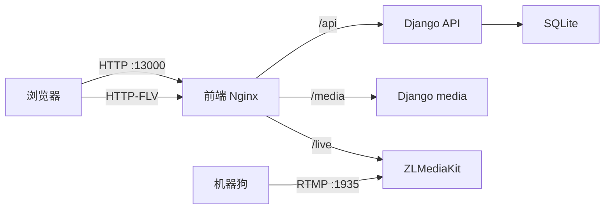
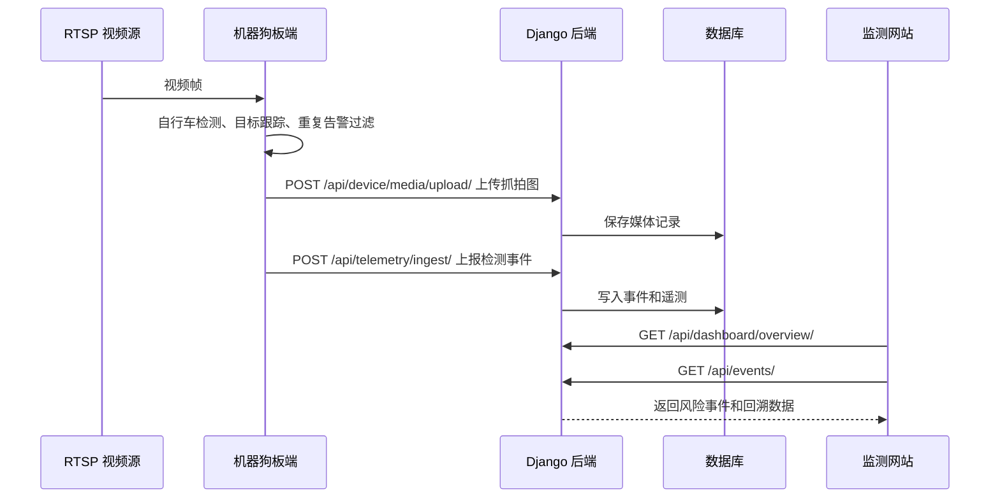
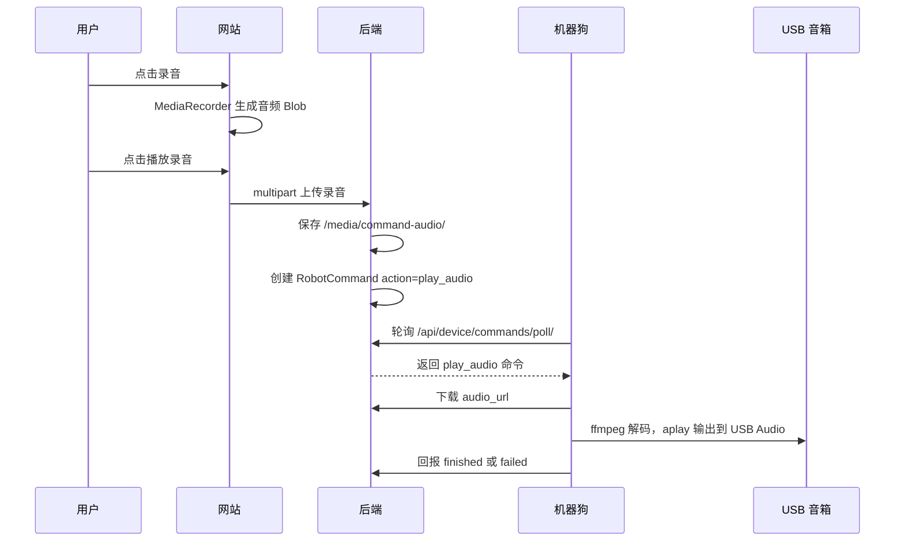

# 智能机器人巡检监测平台当前进度文档

[返回文档中心](./project-docs-index.md)

## 1. 文档目的

本文按照当前项目推进重点整理系统进度，覆盖三类能力：

1. 云环境搭建与使用。
2. 监测风险和事件回溯。
3. 双向语音视频沟通、远程控制与跟随能力。

文档基于当前仓库实现、云端部署状态和机器狗联调结果整理，用于阶段验收、演示说明和后续开发对齐。

## 2. 当前系统概览

系统由四部分组成：

| 模块 | 当前职责 | 部署位置 |
| --- | --- | --- |
| Vue 前端 | 监测工作台、视频查看、事件处理、远程控制、音频喊话和网页录音 | 云服务器 Docker 容器 |
| Django 后端 | 登录鉴权、机器人状态、事件存储、命令队列、媒体文件管理 | 云服务器 Docker 容器 |
| ZLMediaKit | 接收 RTMP 推流，输出 HTTP-FLV 给浏览器播放 | 云服务器 Docker 容器 |
| 机器狗板端 | 视频读取、识别、抓拍、遥测上报、推流、命令轮询、音频播放 | 机器狗本机 |

当前主要访问方式：

当前云端访问地址、API 地址和视频地址以部署环境配置为准；不再使用已下线的旧地址。

说明：浏览器录音能力通常要求 HTTPS 或 localhost。若使用公网 IP 的 HTTP 地址访问，浏览器可能拒绝麦克风权限；建议后续绑定 HTTPS 域名作为正式访问入口。

## 3. 云环境搭建使用

### 3.1 已完成内容

云服务器已完成 Docker 化部署，包含：

- 前端容器：`playground-frontend`，对外端口 `13000`。
- 后端容器：`playground-backend`，对外端口 `18000`，由前端 nginx 代理 `/api/` 与 `/media/`。
- 视频容器：`playground-zlmediakit`，开放 RTMP `1935`、HTTP-FLV 相关端口。
- 后端数据库：当前使用 SQLite，数据保存在容器挂载卷中。
- 媒体文件：抓拍图、录音文件等通过 `/media/` 暴露给前端和机器狗下载。

当前云端部署目录：

```text
/home/hs/playground-deploy
```

主要容器编排文件：

```text
docker-compose.yml
backend/Dockerfile
frontend/Dockerfile
frontend/nginx.conf
```

### 3.2 云端服务链路



### 3.3 使用方式

用户通过浏览器访问监测网站：

使用当前部署环境配置的访问地址。

演示账号：

```text
用户名：operator
密码：admin123456
```

机器狗侧通过配置文件连接云端：

```yaml
telemetry:
  endpoint: "${CENTER_BASE_URL}/api/telemetry/ingest/"
  media_upload_endpoint: "${CENTER_BASE_URL}/api/device/media/upload/"

stream:
  rtmp_url: "${RTMP_BASE_URL}/live/dog_ZSL-1A-07_front"

video:
  play_urls:
    flv: "${CENTER_BASE_URL}/live/dog_ZSL-1A-07_front.live.flv"
```

### 3.4 当前云端能力状态

| 能力 | 状态 | 说明 |
| --- | --- | --- |
| 前端访问 | 已完成 | 可通过 IP + 端口访问 |
| 后端 API | 已完成 | 支持 Token 登录、事件、机器人、命令、媒体上传 |
| 视频服务 | 已完成 | RTMP 推流，HTTP-FLV 播放 |
| 媒体文件访问 | 已完成 | 抓拍图、录音文件可通过 `/media/` 下载 |
| Docker 化部署 | 已完成 | 前后端和 ZLMediaKit 已容器化 |
| HTTPS 域名访问 | 待完善 | 录音权限和生产部署建议使用 HTTPS |
| 数据库生产化 | 待完善 | 当前 SQLite 可演示，正式环境建议 PostgreSQL |

## 4. 监测风险和回溯

### 4.1 已完成内容

当前平台已经具备从机器狗识别到网站回溯的基本闭环：

1. 机器狗读取 RTSP 视频源。
2. 板端使用 YOLO ONNX 模型检测自行车目标。
3. 检测命中后生成事件、抓拍图片和框选图。
4. 板端上传抓拍媒体到后端。
5. 板端上报遥测 JSON 和检测事件。
6. 后端写入 `InspectionEvent`、`RobotTelemetry` 等数据。
7. 前端实时监测中心展示最新事件和机器人状态。
8. 事件中心支持筛选、搜索、排序、时间范围查询和处置归档。

### 4.2 风险识别链路



### 4.3 事件回溯能力

事件中心当前支持：

- 按事件状态查看：全部、待处理、已处理。
- 按时间范围筛选历史事件。
- 按地点、标题、机器人名称、事件类型等关键词搜索。
- 按检测时间排序。
- 查看事件抓拍图和标注图。
- 查看事件位置、机器人、风险等级、检测时间。
- 填写处置备注。
- 选择复核结论并归档。

实时监测中心当前支持：

- 查看实时视频画面。
- 查看当前机器人状态、电量、网络强度、当前任务。
- 查看最近识别事件。
- 通过 SSE 接收新事件提示，减少手动刷新。

### 4.4 已处理的关键问题

| 问题 | 处理结果 |
| --- | --- |
| SSE 长连接占满 Gunicorn sync worker | 后端容器改用 gthread worker，提升并发处理能力 |
| 前端多开后页面内容空白或接口慢 | 优化后端 worker 模式，前端增加加载错误保护 |
| 抓拍图 URL 缺少公网端口导致加载失败 | 改为相对 `/media/` URL，由前端 nginx 统一代理 |
| 视频播放延迟较大 | 推流采用 `-c:v copy`，前端 mpegts 关闭 stash buffer，降低播放器缓存 |
| ONNX 模型输入尺寸不匹配导致 OpenCV DNN 崩溃 | 将板端 `models/bike.onnx` 的 `image_size` 修正为 `640` |

### 4.5 当前风险和待完善项

| 项目 | 当前状态 | 建议 |
| --- | --- | --- |
| 模型识别速度 | 板端可运行，但 CPU 推理约 2fps 左右 | 后续可评估 RKNN/NPU、TensorRT 或轻量模型 |
| 事件去重 | 已有 IoU 跟踪和重复告警间隔 | 后续可加入跨区域、跨时间的更精细规则 |
| 数据持久化 | SQLite 可演示 | 正式环境建议 PostgreSQL 和对象存储 |
| 视频回放 | 当前以实时流和事件抓拍为主 | 若需要完整视频回溯，应增加录像切片和索引 |

## 5. 双向语音视频沟通、控制跟随

### 5.1 视频沟通能力

当前已完成“机器狗到网站”的实时视频链路：

```text
机器狗 RTSP -> ffmpeg -> RTMP -> ZLMediaKit -> HTTP-FLV -> 网站播放
```

实现特点：

- 机器狗端自动推流到云端 ZLMediaKit。
- 网站优先播放 HTTP-FLV。
- 前端播放器使用低延迟参数，减少缓存。
- 当实时流不可用时，页面回退展示事件图或默认图。

当前视频方向主要是单向视频：机器狗现场画面到监控网站。若需要浏览器摄像头反向视频到机器狗，还需要新增 WebRTC 或其他低延迟通道。

### 5.2 语音沟通能力

当前已完成“网站到机器狗”的语音播放链路，包含两种模式：

1. 预置音频播放。
2. 浏览器录音后播放到机器狗。

预置音频当前包括：

```text
自行车驶离
注意避让
```

录音播放链路：



机器狗音频输出已验证：

- USB Audio 设备识别为 `plughw:2,0`。
- 板端优先检测 USB 声卡。
- 播放命令采用 `ffmpeg | aplay -D plughw:2,0`。
- 云端命令状态可回报 `queued`、`sent`、`running`、`finished`、`failed`。

当前语音方向主要是单向语音：网站到机器狗现场音箱。若需要机器狗麦克风回传到网站，需要新增板端采集音频和浏览器播放通道。

### 5.3 远程控制能力

当前已完成远程接管和动作控制基础链路：

- 进入远程接管：`takeover_enter`。
- 退出远程接管：`takeover_exit`。
- 紧急停止：`passive` 或停止动作。
- 基础运动：前进、后退、左移、右移、左转、右转。
- 技能动作：站立、趴下、握手、跳跃、双腿站立等。
- 长按控制：前端按住方向键持续下发运动命令，松开后下发停止。

当前控制链路：

```text
网站 -> Django RobotCommand -> 板端控制服务 -> 机器狗 SDK
```

说明：

- 板端默认保持手柄模式，避免程序启动后立即抢占机器人控制权。
- 只有进入远程接管后，才执行真实 SDK 动作。
- 退出接管时会尽量停止运动并释放 SDK 控制。

### 5.4 跟随能力状态

当前已经具备“控制通道”和“视频识别基础”，但自动跟随功能尚未形成完整闭环。

已具备基础：

- 实时视频输入。
- 目标检测和跟踪。
- 远程运动控制命令。
- 机器人状态上报。

待补齐内容：

- 明确跟随目标：人、自行车或指定目标。
- 目标位置到机器人速度的控制策略。
- 跟随安全边界：最小距离、最大速度、丢失目标后的停止策略。
- 与 SDK 控制模式的互斥关系。
- 前端跟随开关、状态显示和紧急退出。

建议后续将“自动跟随”作为单独功能迭代，避免与当前人工远程接管混用导致控制冲突。

## 6. 阶段结论

当前项目已经完成从云端部署、机器狗接入、实时视频、风险识别、事件回溯、远程控制、网站录音喊话到机器狗 USB 音箱播放的主要演示闭环。

适合当前阶段演示的能力：

- 云端网站访问和设备接入。
- 实时视频查看。
- 自行车违规停放风险识别。
- 事件抓拍和历史回溯。
- 事件复核归档。
- 网站预置音频和录音喊话到机器狗。
- 远程接管和基础动作控制。

建议后续优先完善：

- HTTPS 域名访问，保证网页录音权限稳定。
- 生产数据库、媒体对象存储和日志监控。
- 视频录像回放。
- 自动跟随控制策略。
- 设备密钥认证和命令权限控制。
