# RoamerX 智能巡检云平台操作手册

> 适用地址：<https://39.107.250.69/>  
> 截图基准：2026-08-17，均采集自该线上平台的实际界面。  
> 适用角色：值班员、巡检管理员、机器人运维人员。请仅使用组织发放的账号；本文不提供或复述账号密码。

## 1. 平台概览

云平台把机器人巡检的日常工作集中在一个网页工作台中：查看视频与设备状态、接收和闭环事件、管理机器人、配置地图/路线/禁区、创建巡检模板和排班计划，以及在授权条件下远程控制机器人和进行 AI 开发任务。

### 1.1 安全分级

|类别|包含功能|操作要求|
|---|---|---|
|查看|监测、统计、事件查看、机器人状态、轨迹回放|可按职责直接使用。|
|配置|任务模板、排班、地图上传、路线、禁区、语音模板|先核对机器人、地图和路线，保存前复核。|
|物理动作|接管、移动、跟随、喊话、开始/停止巡检、建图、导航初始化、立即执行、回充|须已取得现场授权；确认机器人周边无人、通信正常、有可用急停方案。本文档的采集过程未执行这些操作。|

### 1.2 本次线上状态说明

- 登录、菜单和各工作台页面均可访问；截图反映采集时的实际内容与空状态。
- 保安值守和监测中心的数据区域当时仍在加载；不要把空白或“加载中”理解为机器人安全。应先到“机器人管理”核实设备状态，并检查边缘服务。
- 远程 AI 开发页显示 Dev Agent 离线；地图页显示 Edge Agent 状态未知。两者恢复在线前，不应下发对应的开发或现场建图操作。

## 2. 登录与通用界面

### 2.1 登录

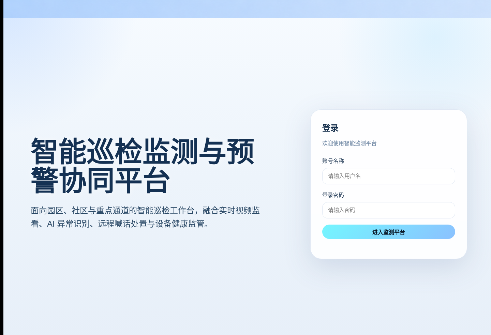

1. 在受信任网络的浏览器中打开 <https://39.107.250.69/>。
2. 输入组织发放的“账号名称”和“登录密码”。
3. 选择“进入监测平台”。首次使用或登录失败时，请联系平台管理员核对账号权限，不要在群聊或工单中发送密码。
4. 登录后默认进入“监测中心”。右上角可切换深色显示或退出登录。

### 2.2 菜单结构

左侧栏是全局导航；“巡检任务”带有子菜单。

```text
智能巡检平台
├─ 保安值守
├─ 监测中心
├─ 远程控制
├─ 远程 AI 开发
├─ 统计分析
├─ 事件中心
├─ 机器人管理
└─ 巡检任务
   ├─ 巡检任务（任务模板）
   ├─ 巡检日历
   ├─ 地图管理
   ├─ 路径规划
   ├─ 禁区管理
   └─ 轨迹回放
```

通用约定：蓝色主按钮通常表示保存、创建或下发；红色按钮通常表示停止、删除或强制退出；灰色/浅色按钮一般用于刷新、取消、编辑或查看。按钮不可用时，先检查必填项、设备在线状态和角色权限。

## 3. 保安值守

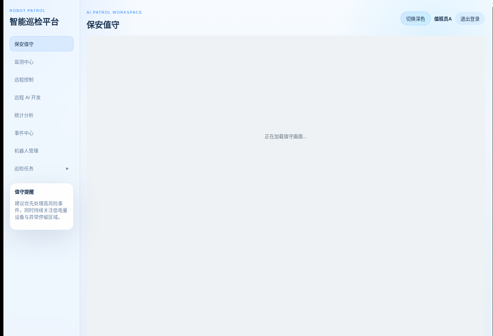

本页把实时画面、任务状态、告警、定位和循环巡检放在同一工作台，适合值班人员使用。

### 查看值守信息

1. 选择左侧“保安值守”。
2. 等待“正在加载值守画面…”消失，确认视频、任务状态、地图和报警区域均有数据。
3. 若持续加载，转到“机器人管理”确认设备在线，并核对 NX Edge Agent 与云端连接；不要反复点击启动按钮。

### 启动、控制或退出巡检（物理动作）

1. 确认已选中正确机器人，地图定位正常，预设任务和现场隔离均已就绪。
2. 选择“开始巡检”；仅在状态变为执行中后观察路线、途经点和实时画面。
3. 需要暂停/恢复时使用任务控制按钮，等待状态反馈后再进行下一步。
4. 仅在出现无法恢复的异常且已获授权时选择“强制退出”。操作后检查事件中心与任务执行详情。

### 定位、循环和实时喊话

1. 定位未初始化时，先确认正确地图和机器人静止，再选择“初始化定位”，等待成功提示。
2. 启用循环前设置总时长与休息时间，复核巡检任务；选择循环启动/停止按钮后观察轮次与倒计时。
3. 使用“实时喊话”前确认现场允许播放。输入文字后发送，或按“开始录音”录制、再“结束并播放”。
4. 对任何异常报警，点击待处理数量进入“事件中心”完成复核闭环。

## 4. 监测中心

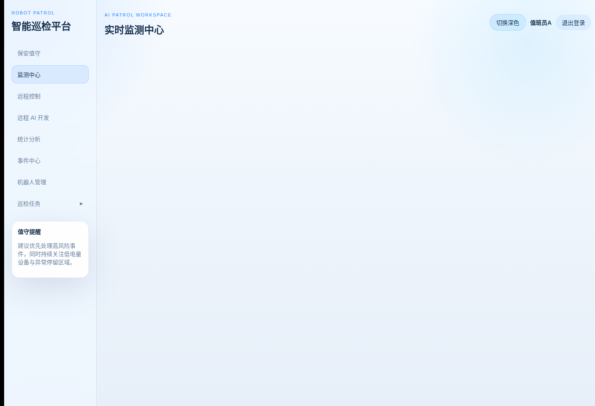

监测中心用于汇总实时视频、告警、设备电量与人工处置能力。截图采集时页面主体未完成加载，因此应以页面恢复后的数据为准。

### 日常查看

1. 选择“监测中心”，等待视频与摘要卡片加载。
2. 核对设备在线、今日告警、当前位置、电量和视频源；无信号或无数据时先检查机器人状态，不直接接管。
3. 点击事件或告警入口进入“事件中心”查看证据与处理进度。

### 人工接管、急停与喊话（物理动作）

1. 仅在现场授权、视频可用且机器人周边安全时选择“接管”。
2. 按住方向键进行短时、低速移动；松开即停止。先试小幅动作，始终保持视频可见。
3. 发生失控风险时使用“紧急停止”，随后通知现场人员并在事件中心记录处置。
4. 使用文字播报、录音或告警试播前，确认目标机器人和音响状态；试播/播放会产生现场声音。

## 5. 远程控制

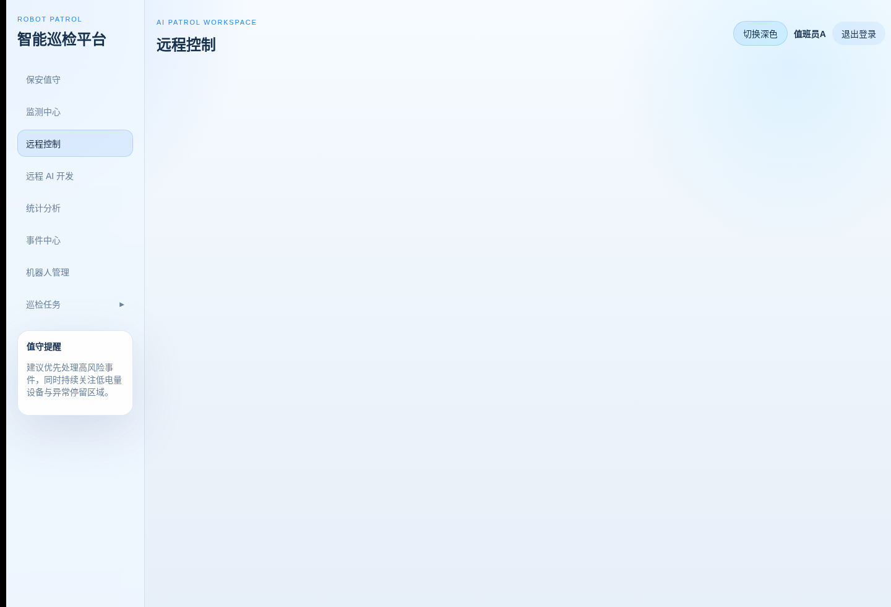

远程控制页提供设备选择、视频操控、人员识别与持续跟随。该页所有移动、姿态、跟随和阻尼操作均属于物理动作。

### 查看设备与人员识别

1. 打开“远程控制”，在“设备选择”中确认目标机器人。
2. 查看实时视频与状态卡片，确认电量、网络、定位和运动控制状态。
3. 如需识别人员，先选择“开启人员识别”，等待画面或人员列表刷新，再点击目标人员卡片进行选择。

### 人员跟随（物理动作）

1. 确保现场许可跟随、路线无禁区或障碍，并已选中正确目标人员。
2. 选择“开始跟随”，持续观察视频和状态。
3. 人员离开安全区域、识别不稳定或有人进入机器人周边时，立即选择停止跟随/阻尼并由现场人员确认。

### 手动运动与姿态（物理动作）

1. 先选择“启动运控”，确认状态已反馈成功。
2. 选择速度档位后，按住方向或转向控件进行短距离测试；松开控件应停止。
3. 需要起立、匍匐或阻尼时，只点击一次并等待结果；不要连续重复下发。
4. 完成操作后选择“停止运控”，再核对机器人最终姿态和位置。

## 6. 远程 AI 开发

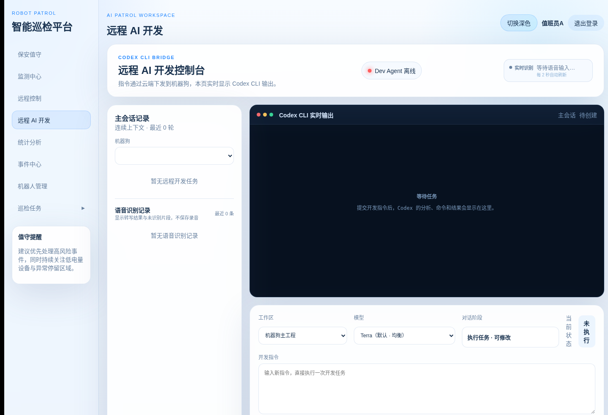

该页通过云端向机器狗侧 Codex CLI Bridge 提交开发任务，并显示会话和语音识别记录。截图状态为 Dev Agent 离线，因此当前不具备安全提交条件。

### 查看会话与识别记录

1. 选择“远程 AI 开发”。
2. 在“机器狗”下拉框确认目标设备，查看连接状态、主会话记录和语音识别记录。
3. Dev Agent 显示离线时，停止在此页操作，通知运维恢复服务后再试。

### 提交或取消开发任务（会改变机器人侧开发环境）

1. 确认开发窗口、目标机器人、工作区和模型均正确，并且变更已通过代码评审。
2. 填写明确、可审计的任务提示词；禁止把生产密钥、账号密码或无关数据放入提示词。
3. 选择提交，阅读实时输出；若输出异常或目标不符，立即选择取消。
4. 完成后核查会话结果与机器人服务健康状态，再允许恢复业务任务。

## 7. 统计分析

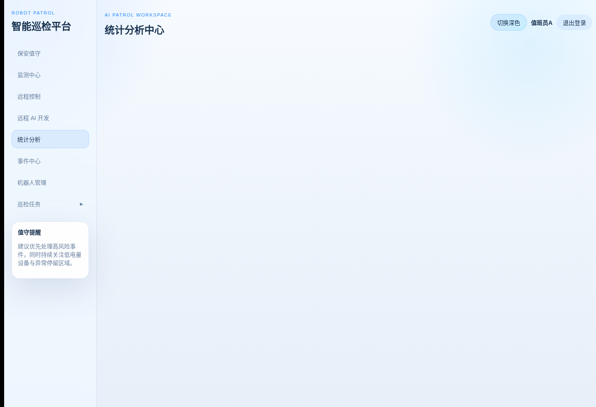

统计分析中心汇总巡检、告警和设备运行趋势，适合班次交接、周报和异常复盘。

1. 打开“统计分析”。
2. 选择页面提供的时间范围、机器人或统计维度（如有），等待指标卡和图表刷新。
3. 对突增的告警量、下降的在线率或异常巡检时长，转到“事件中心”和“机器人管理”查明原因。
4. 导出或引用数据前，记录筛选时间和口径，避免把不同时间范围的数据混用。

## 8. 事件中心

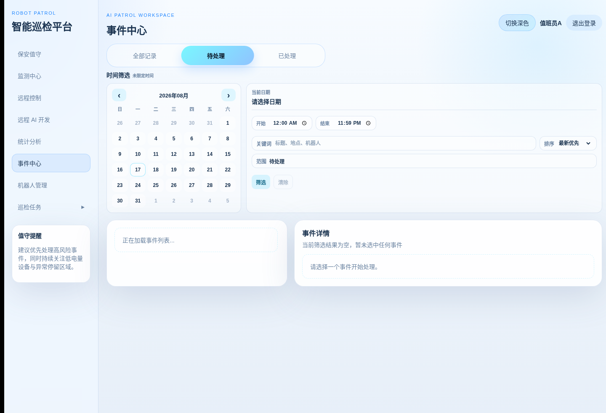

事件中心用于筛选、查看、复核和归档异常事件。

### 筛选和查看事件

1. 选择“事件中心”。
2. 通过“全部记录 / 待处理 / 已处理”切换状态；可用日历、起止时间、关键词和排序进一步筛选。
3. 在列表中点击事件，查看抓拍图、检测信息、发生时间、关联机器人和历史处置。
4. 使用“加载更多”浏览下一页记录，避免只依据当前首屏判断事件数量。

### 复核与归档

1. 只对已核验的事件进行处置，选择复核结论并填写必要说明。
2. 确认不是仍在发生的安全风险后，选择处理/归档按钮。
3. 对需要现场处置的事件，先完成现场确认，再在事件详情留下可追溯的结论。

## 9. 机器人管理

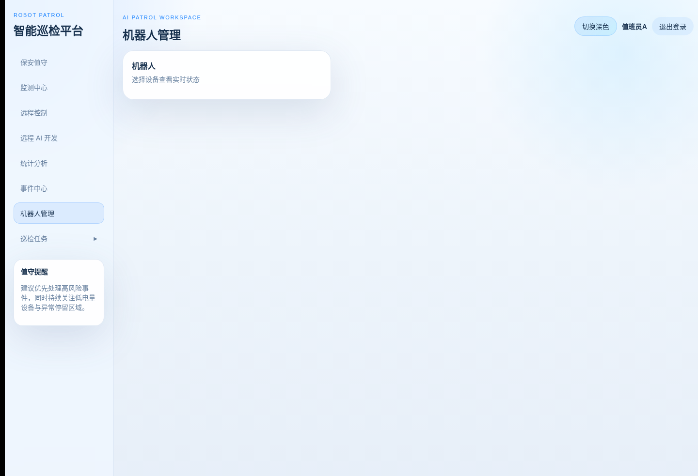

机器人管理页用于选择设备、查看健康状态、刷新信息、管理充电与相关配置。

### 查看与刷新

1. 选择“机器人管理”。
2. 从机器人卡片选择目标设备，查看在线状态、电量、位置、流媒体和最近事件。
3. 需要更新显示时选择该卡片上的刷新图标，等待状态返回；持续离线时联系边缘侧运维。

### 充电与设备控制（物理动作）

1. 点击“一键回充”前，确认机器人当前地图、回充路线、充电桩通道和现场无人阻挡。
2. 在弹窗中选择充电地图与两点回充路线，逐项复核后选择“确认一键回充”。
3. 监看任务和位置反馈；失败时不要连续下发，应检查定位、路线和充电桩状态。
4. 页面上的音量、识别或对齐类设置会影响设备行为，只由授权运维人员修改并记录变更。

## 10. 巡检任务（任务模板）

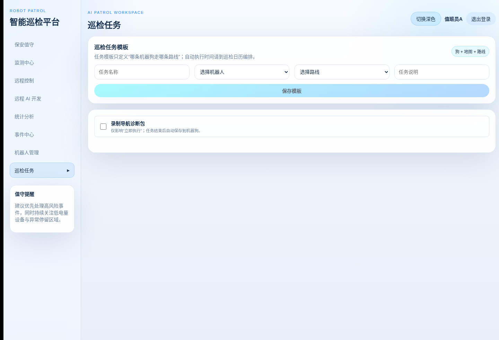

任务模板定义“哪台机器人走哪条路线”；自动执行的时间由“巡检日历”管理。

### 新建模板

1. 打开“巡检任务”。
2. 填写任务名称，依次选择机器人和路线，必要时填写说明。
3. 如需在立即执行后保留导航诊断资料，勾选“录制导航诊断包”；该选项会增加存储占用。
4. 复核“狗 + 地图 + 路线”一致后选择“保存模板”。

### 立即执行、详情与删除（物理动作/高风险变更）

1. 在目标模板上确认机器人在线、定位正常、路线和现场均安全。
2. 选择“立即执行”，只点击一次；随后通过“详情”查看执行状态、路径和事件。
3. 不再使用的模板可删除；强制删除仅用于常规删除失败且已确认没有计划或运行任务引用该模板的情况。

## 11. 巡检日历

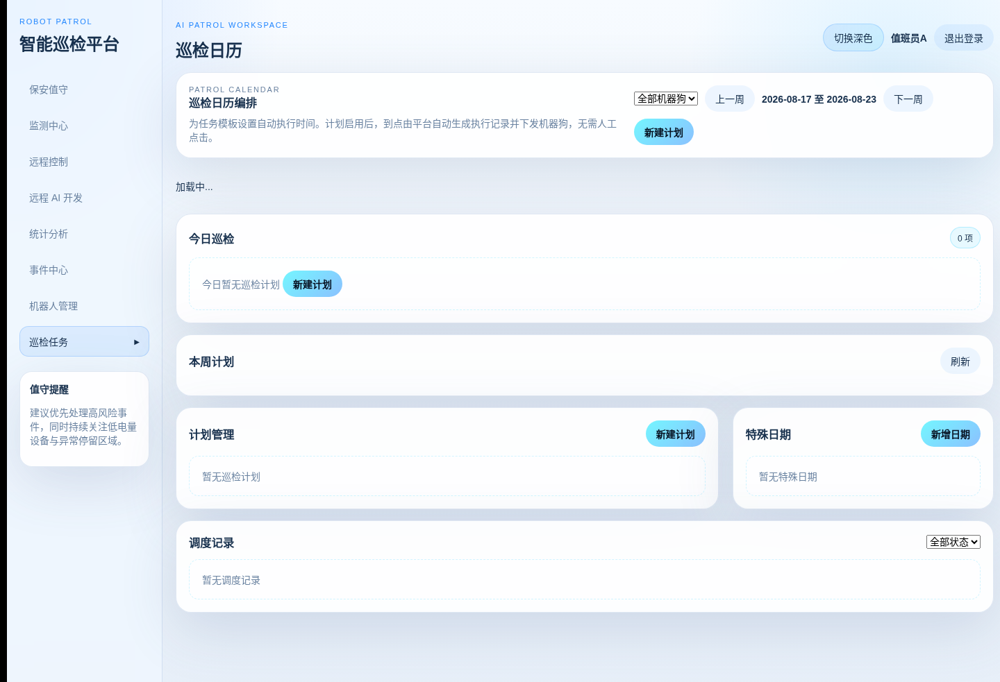

巡检日历为已保存的任务模板设置自动执行时间，并展示今日、本周和调度记录。

### 新建或编辑计划

1. 选择“巡检日历”，先按机器人筛选并查看本周计划是否冲突。
2. 选择“新建计划”，填写计划名称、机器人、任务模板、路线、计划类型、时间、星期/日期、优先级和备注。
3. 只有在时间、路线、现场保障均已确认后勾选“启用计划”并保存。
4. 对已有计划选择“编辑”修改；需要临时停运时选择“停用”，而非删除历史记录。

### 执行与特殊日期

1. “立即执行”会创建并下发真实任务，执行前遵循本手册的物理动作检查。
2. 在“今日巡检”或“调度记录”中选择“详情”查看执行结果。
3. 使用“新增日期”维护节假日、禁行日等特殊日期；填写日期、名称、类型、备注并启用后保存。

## 12. 地图管理

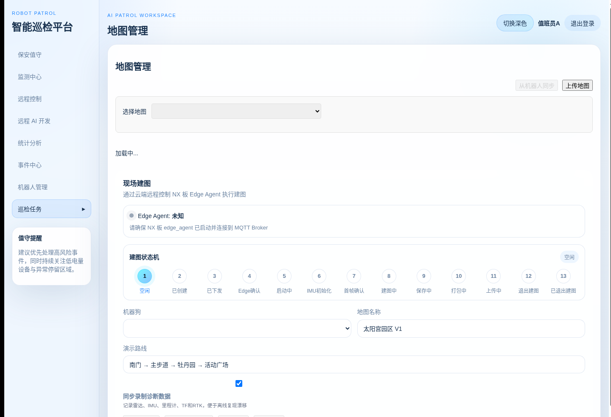

地图管理支持从机器人同步、上传、设为活动地图、清理障碍和现场建图。截图中 Edge Agent 状态未知，现场建图按钮应保持不操作。

### 同步、上传与维护地图

1. 选择“地图管理”，在下拉框选择需要查看的地图。
2. 从设备同步前，确认目标机器人在线且 Edge Agent 已连接；选择“从机器人同步”后等待完成，不重复发起。
3. 上传地图时选择“上传地图”，填写名称，选择配套 PGM 和 YAML 文件，可选缩略图、分辨率与描述，然后确认上传。
4. 选中已有地图后，可按权限下载、设为活动地图或删除；删除/强制删除前确认路线、任务和禁区不再引用该地图。

### 擦除动态障碍与现场建图（高风险配置）

1. 打开“擦除障碍”，在地图上使用擦除/移动工具，必要时调整笔刷和缩放；用撤销/重做复核区域。
2. 选择保存前确认不会擦除固定墙体、台阶或真实禁区。
3. 现场建图前必须确认 Edge Agent 在线、机器人已选定、现场允许建图且无正在执行的巡检。
4. 按状态机顺序启动、保存或取消建图；任何状态异常都停止操作并保存诊断信息给运维人员。

## 13. 路径规划

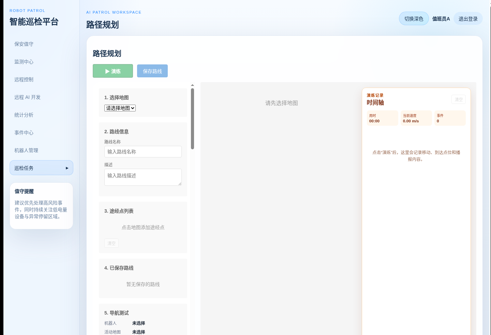

路径规划将地图点击形成的途经点保存为路线，并提供定位、导航和演练工具。

### 创建路线

1. 选择“路径规划”，先在“1. 选择地图”中选中正确地图；跨图场景同时选择地图集。
2. 填写路线名称和描述，在地图上使用“添加途经点”逐点添加；需要时为点位设置朝向、定位方式和语音模板。
3. 检查途经点列表，可清空或删除误加点；确认路线避开禁区、楼梯和动态高风险区域。
4. 选择“保存路线”。保存后在“已保存路线”中加载并复核。

### 导航测试与执行（物理动作）

1. 先刷新导航状态，确认设备在线、地图一致、定位正常。
2. 只有运维授权时才启动/重启/恢复/停止导航栈，或下发初始定位；每次操作后等状态返回。
3. “执行路线”会使机器人运动。执行前清场、核对禁区与路线，执行中持续监看并保留紧急停止措施。
4. “演练”用于验证路线逻辑，仍应把它当作可能影响现场的操作，按真实执行标准授权。

## 14. 禁区管理

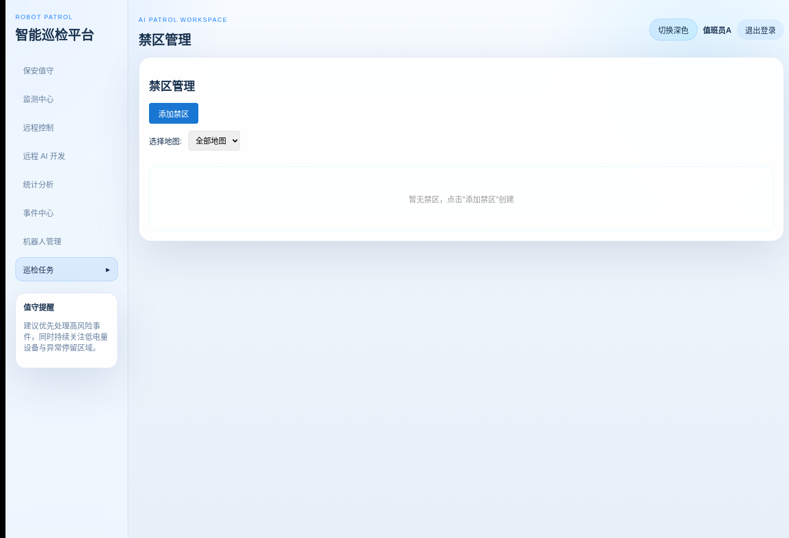

禁区是机器人不应进入或需要特殊规则处理的地图区域。

### 新增或编辑禁区

1. 选择“禁区管理”，先按地图筛选现有禁区，避免重复或重叠配置。
2. 点击“添加禁区”，填写名称、关联地图、禁区类型、多边形顶点和描述，并设置启用状态。
3. 顶点采用 JSON 多边形数据；保存前核对坐标系、闭合顺序和边界是否覆盖真实危险区域。
4. 已有禁区可选择“编辑”；需要删除时先确认没有运行任务会立即进入该区域。

## 15. 轨迹回放

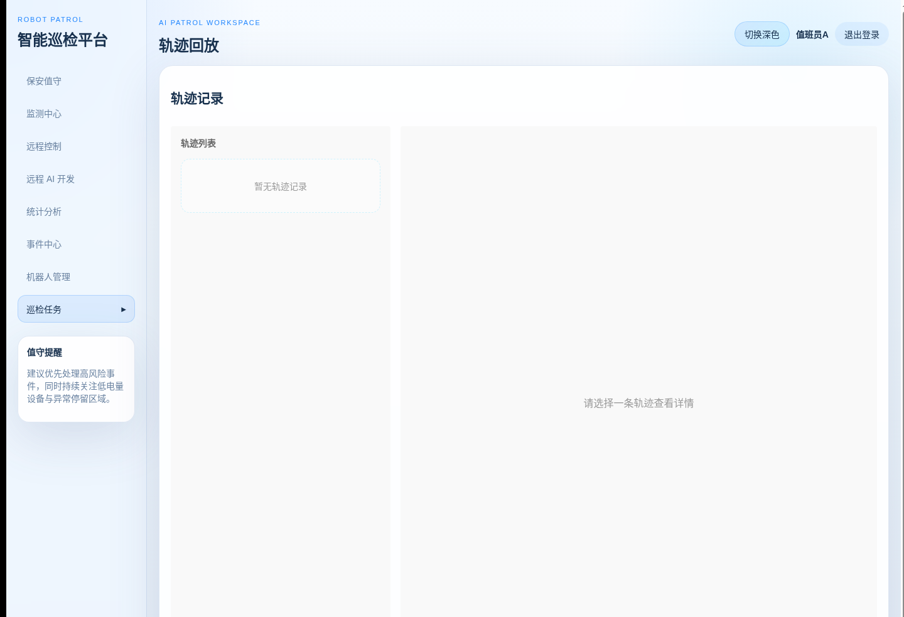

轨迹回放用于查看既往巡检路径、时间和运行记录。截图采集时没有可用轨迹记录。

1. 选择“轨迹回放”。
2. 在左侧“轨迹列表”选择一条记录，右侧查看轨迹详情和路径预览。
3. 使用播放/暂停、重置等控件回放，结合事件时间线排查偏航、停留或异常中断。
4. 删除轨迹会减少复盘证据；仅在数据保留策略允许且确认不再需要时删除。

## 16. 任务执行详情

该页不是左侧一级菜单；可从任务模板、巡检日历的“详情”进入。其内容随具体执行记录变化。

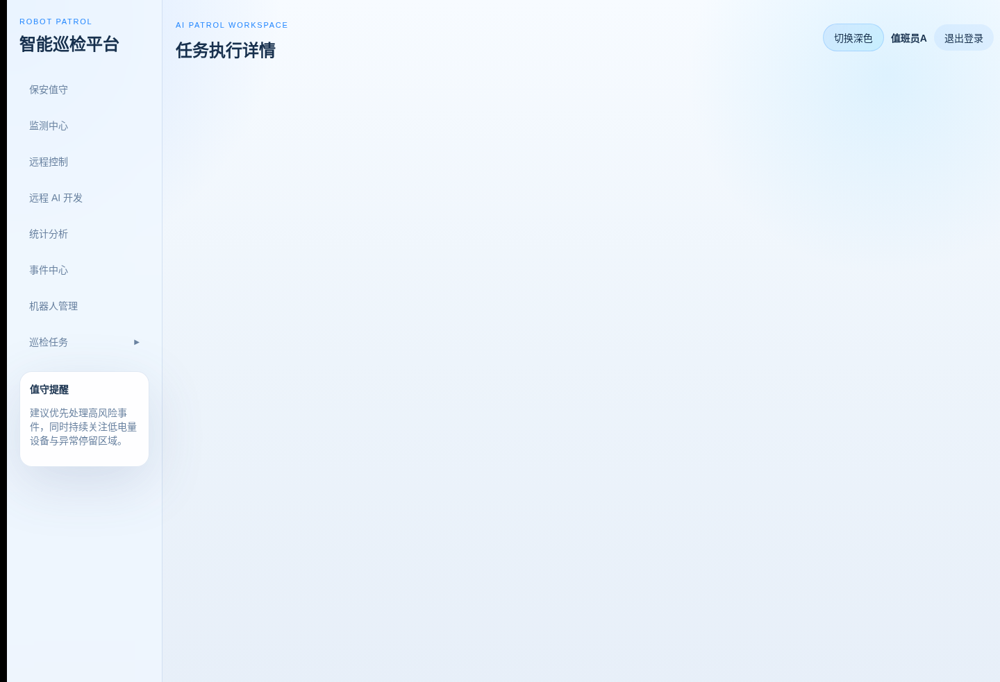

截图为线上一条历史执行记录的详情入口状态；数据区域如持续加载，应保留记录编号并交由平台运维检查任务执行接口，而不是重复下发任务。

1. 在“巡检任务”“今日巡检”或“调度记录”中点击目标记录的“详情”。
2. 查看任务状态、机器人、路线快照、开始/结束时间、途经点进度、轨迹和关联事件。
3. 仅在具备授权且状态允许时使用暂停、恢复、取消等控制；操作后刷新并确认状态变化。
4. 任务失败、超时或中断时，保留该详情页信息、关联事件和诊断包，交由运维复盘。

## 17. 班前、班中与班后检查

### 班前

1. 登录后先查看机器人在线、电量、定位、视频与边缘服务状态。
2. 查看事件中心的待处理事件，核对当天计划、禁区和路线。
3. 对地图页显示的 Edge Agent 未知、开发页显示的 Dev Agent 离线等状态先完成运维恢复，不进行相关下发操作。

### 班中

1. 优先在保安值守/监测中心观察，再决定是否进入远程控制。
2. 每项物理动作只下发一次并等待反馈；发生异常先停止/阻尼/急停并通知现场。
3. 对告警进行筛选、查看、处置和闭环，保留必要的事件说明。

### 班后

1. 检查正在运行的任务、计划和充电状态，避免交接后出现无人监管的自动执行。
2. 完成事件复核，记录异常和临时变更。
3. 退出登录，不在公共终端保存浏览器密码或会话。
