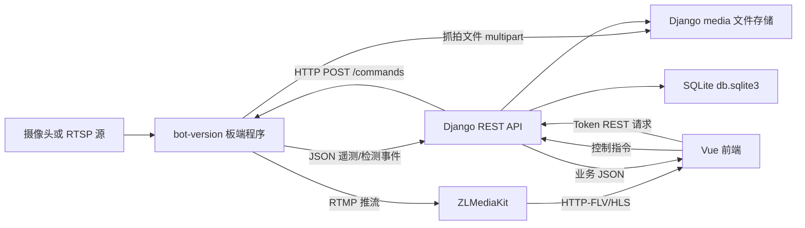
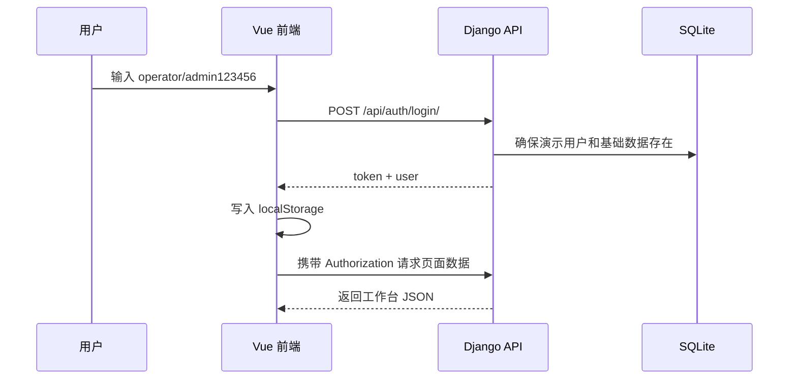
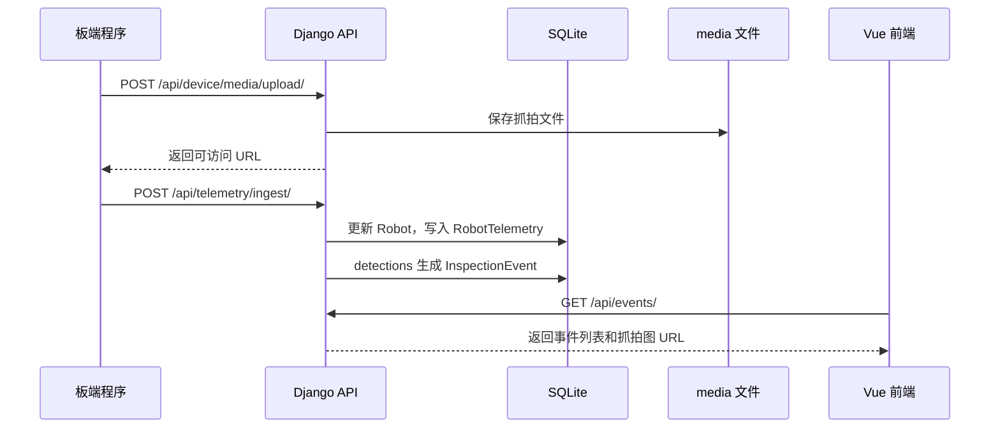
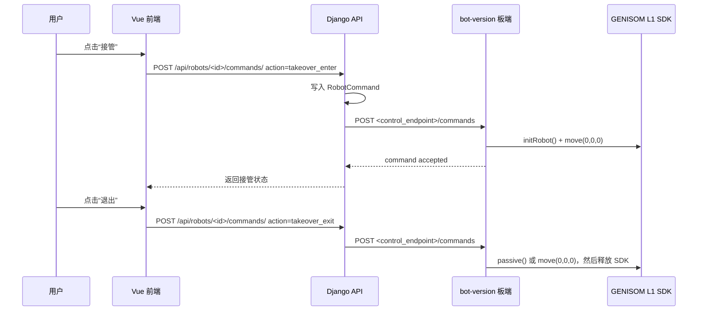

# 项目整体架构

[返回文档中心](./project-docs-index.md)

## 1. 系统定位

智能机器人巡检监测平台用于对机器人巡检过程进行统一值守。前端提供值班工作台，后端提供业务接口与数据存储，板端程序负责读取摄像头或 RTSP 视频流、执行自行车识别、生成事件与遥测数据，并可将视频推送到 ZLMediaKit 供浏览器播放。

## 2. 架构总览



## 3. 模块职责

| 模块 | 路径 | 主要职责 |
| --- | --- | --- |
| 后端服务 | `backend/` | 用户登录、Token 鉴权、机器人/事件/任务/遥测/媒体数据管理、演示数据初始化 |
| 前端工作台 | `frontend/` | 登录、实时监测、事件中心、统计分析、机器人管理、巡检任务展示 |
| 板端程序 | `bot-version/` | 视频读取、YOLO 检测、目标跟踪去重、抓拍、JSON 上报、RTMP 推流 |
| 视频服务 | `docker-compose.zlmediakit.yml` | 接收 RTMP，输出 HTTP-FLV/HLS，解决浏览器无法直接播放 RTSP 的问题 |
| 文档 | `docs/` | 接口协议、运行说明、视频方案、项目说明 |

## 4. 后端结构

```text
backend/
  manage.py
  config/
    settings.py      Django 配置、数据库、REST Framework、CORS
    urls.py          根路由，挂载 /api/
    asgi.py
    wsgi.py
  monitoring/
    models.py        业务数据模型
    serializers.py   出入参校验和 JSON 序列化
    views.py         REST API 视图
    urls.py          API 路由
    migrations/      数据库迁移
```

后端使用 Django REST Framework。默认开启 `TokenAuthentication` 和 `IsAuthenticated`，但健康检查、登录、板端遥测上报、媒体上传接口允许匿名访问，便于演示和板端接入。

## 5. 前端结构

```text
frontend/
  src/
    main.js
    App.vue
    router/index.js          路由与登录守卫
    services/api.js          REST API 封装
    views/
      LoginPage.vue
      DashboardLayout.vue
      DashboardOverview.vue
      AnalyticsPage.vue
      EventsPage.vue
      RobotsPage.vue
      TasksPage.vue
    components/
      TrendLineChart.vue
      AppToast.vue
    composables/
      useTheme.js
      useToast.js
    style.css
```

前端基于 Vue 3、Vue Router、Vite。登录成功后将 Token 写入 `localStorage.inspection_token`，后续请求统一带上 `Authorization: Token <token>`。

## 6. 板端结构

```text
bot-version/
  run_edge.py            完整板端入口：检测、上报、可选推流
  run_stream.py          仅推流入口
  config.example.yaml    配置模板
  config.yaml            本地实际配置
  src/bike_bot/
    main.py              多线程运行编排
    config.py            YAML 配置加载
    detector.py          YOLO/OpenCV DNN 检测与抓拍
    tracking.py          目标跟踪与重复告警控制
    telemetry.py         遥测构造、媒体上传、JSON 上报、本地日志
    stream.py            ffmpeg RTMP 推流
    runtime.py           运行状态快照
    models.py            上报数据结构
```

## 7. 核心业务链路

### 7.1 用户登录与页面访问



### 7.2 板端上报事件



### 7.3 视频播放链路

浏览器不能直接播放 RTSP，因此项目使用板端 ffmpeg 将 RTSP 推成 RTMP，ZLMediaKit 再输出 HTTP-FLV/HLS。

```text
RTSP 摄像头 -> ffmpeg -> RTMP -> ZLMediaKit -> HTTP-FLV/HLS -> Vue video 播放器
```

### 7.4 远程控制链路

当前 demo 采用后端主动访问板端控制服务：



这种方式要求后端能访问机器人的 `control_endpoint`。如果云端后端无法直接访问内网机器人，建议改为板端长轮询、MQTT 或 WebSocket 反向连接。
板端默认保持手柄模式，不初始化 SDK，也不采样 SDK 状态；只有接管成功后才执行普通远程动作。

前端优先使用 `Robot.play_urls.flv`，若浏览器环境不支持或无 FLV，则回退到 HLS；如果没有实时流，则显示事件图或默认图片。

## 8. 安全与演示边界

当前项目以演示闭环为主：

- `DEBUG=True`。
- `CORS_ALLOW_ALL_ORIGINS=True`。
- 演示账号会在登录或接口访问时自动创建。
- 板端上报和媒体上传接口当前 `AllowAny`。
- 数据库为 SQLite。
- 媒体文件存储在本地 `backend/media/`。

生产环境建议见 [运维、测试与排障](./operations-and-troubleshooting.md)。
