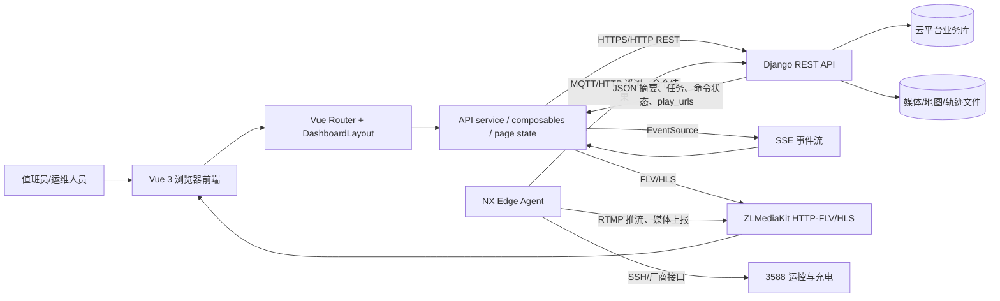
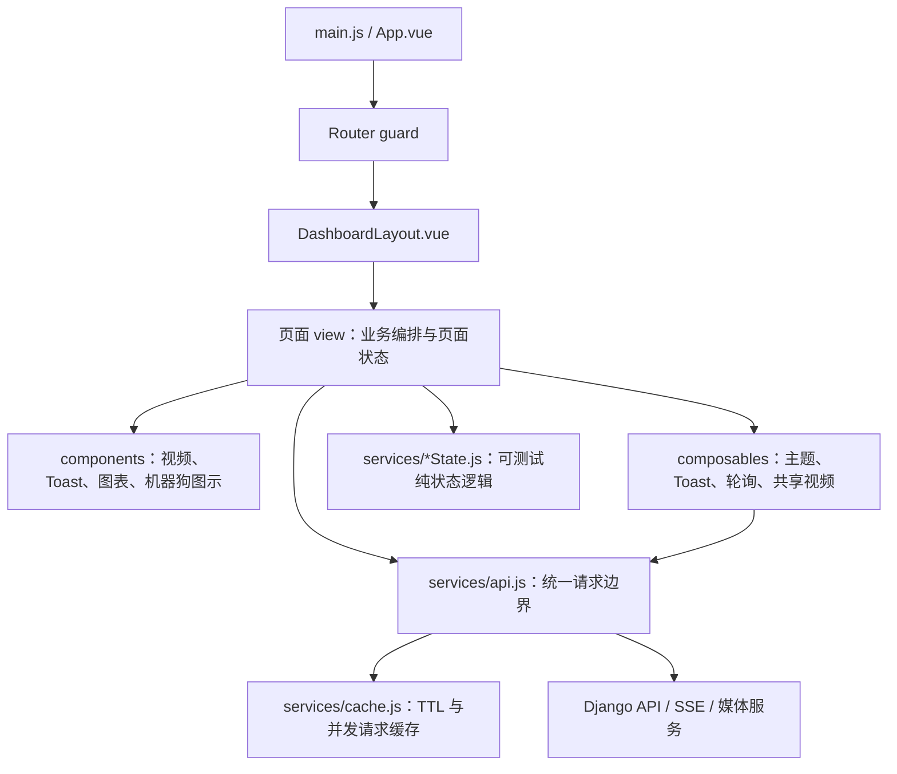
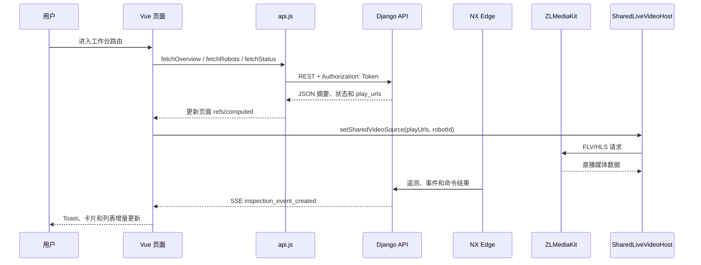
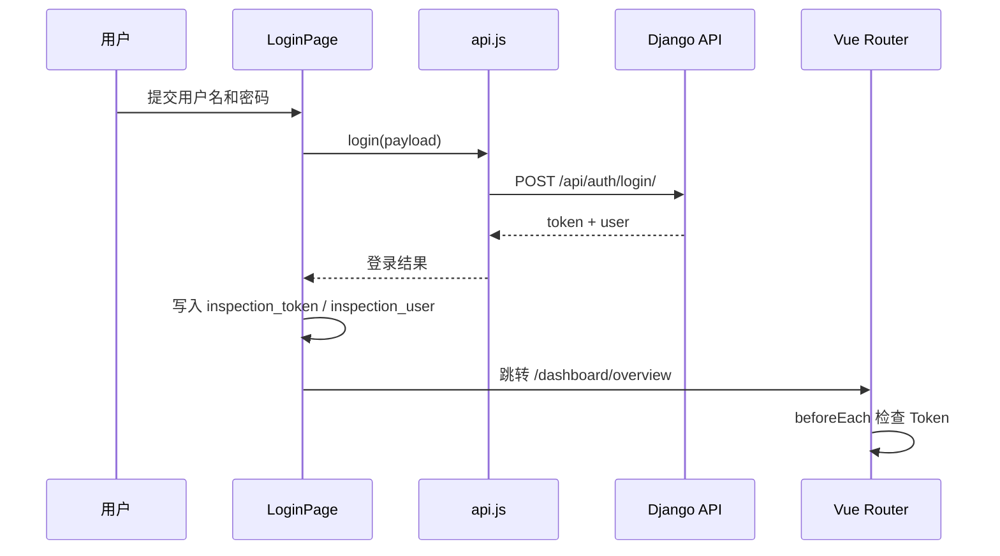
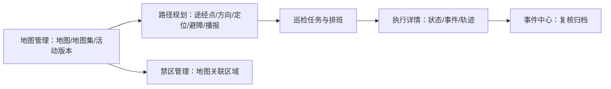

# RoamerX 前端总体架构与监测视频链路

## 0. 文档信息

| 项目 | 内容 |
| --- | --- |
| 项目名称 | RoamerX 智能巡检平台 Web 前端 |
| 文档版本 | 2.0 |
| 文档状态 | 与当前 `platform/frontend` 源码和部署配置同步 |
| 维护者 | RoamerX 平台团队 |
| 初版来源 | 前端监测、巡检任务和路径规划架构说明 |
| 最近更新 | 2026-08-24 |
| 适用源码 | `/home/dogrobot/platform/frontend` |
| 目标读者 | 前端、后端、Edge、测试、部署和新加入项目的开发人员 |

本文是前端需求与实现之间的共同约定。它描述当前已经存在的技术实现、模块边界、数据流、验收方法和已知生产化缺口；它不是产品需求文档，也不替代接口字段定义或机器人安全操作手册。

相关文档：

- [RoamerX 系统总体架构](ROAMERX_SYSTEM_ARCHITECTURE.md)
- [巡检任务、地图与路径规划架构](INSPECTION_TASK_ROUTE_ARCHITECTURE.md)
- [三端数据架构](architecture/THREE_ENDPOINT_DATA_ARCHITECTURE.md)
- [前端功能说明](../platform/docs/website-features.md)
- [前后端接口与数据传输格式](../platform/docs/api-and-payloads.md)

## 1. 文档目标、项目背景与术语

### 1.1 文档目标

一份完整的前端架构文档的核心目标，是让团队对技术实现形成统一理解，降低需求、开发、联调和验收之间的沟通成本，并为长期维护和迭代提供稳定的判断依据。本文重点回答以下问题：

1. 哪些页面、组件和服务属于同一个边界，哪些逻辑不能跨边界复制？
2. 页面数据、实时事件、视频和机器人命令分别通过什么链路流动？
3. 哪些状态可以在浏览器侧保存，哪些数据必须以云平台 API 为事实源？
4. 如何在没有后端、媒体服务或真实机器人时验证布局和业务状态？
5. 响应式改动、播放器切换和视觉基线更新的安全边界是什么？

### 1.2 项目背景与前端目标

RoamerX 面向园区、社区和重点通道的机器狗巡检场景。云平台负责业务数据、任务编排、事件审计、命令生命周期和网页展示；NX Edge Agent 负责断线可恢复的现场执行、设备适配和数据上报；3588 负责厂商运动控制与充电。浏览器前端是值班员和运维人员使用的统一工作台，连接云平台 API、SSE 实时事件和 HTTP-FLV/HLS 视频服务。

前端的核心业务目标是：

- 进入页面后先显示可操作的工作台骨架，再异步加载摘要、机器人、任务和媒体数据；
- 将监测、告警、值守、远程控制、地图、路线、任务和执行记录组织成统一的工作台导航；
- 在视频不可用、网络抖动或后端部分接口失败时，保持非视频卡片和必要的错误反馈可用；
- 通过地图 ID、路线 ID、任务执行 ID 和机器人 ID 保持跨页面业务关联；
- 对远程接管、导航、建图、语音和急停等物理副作用保留确认、禁用、状态轮询和安全停止语义；
- 以固定模拟数据和浏览器视口验证响应式布局，不把视觉测试与真实机器人绑定。

前端不负责直接读写 Django 数据库、NX Edge SQLite、地图文件、rosbag 或 3588 状态文件。三端数据的所有权和持久化边界以[三端数据架构](architecture/THREE_ENDPOINT_DATA_ARCHITECTURE.md)为准。

### 1.3 名词解释

| 名词 | 解释 |
| --- | --- |
| 工作台 / Dashboard | 登录后承载全部 `/dashboard/*` 页面、导航、主题、用户和退出登录的页面壳层 |
| API service | `src/services/api.js` 中的统一 HTTP 请求和业务接口函数层 |
| Edge | NX Edge Agent，负责现场执行、设备适配和消息上报，不等同于浏览器前端 |
| SSE | Server-Sent Events，浏览器通过 `EventSource` 接收告警、建图和远程开发事件 |
| HTTP-FLV | 由 ZLMediaKit 提供的低延迟浏览器视频入口，前端使用 `mpegts.js` 播放 |
| HLS | HTTP Live Streaming，前端使用 `hls.js` 或浏览器原生能力播放，兼容性优先于 FLV |
| SharedLiveVideoHost | 挂载在工作台壳层的共享视频宿主，避免多个页面同时创建播放器 |
| `playUrls` | API 返回的播放地址对象，当前主要包含 `flv` 和 `hls` |
| 视觉基线 | 经确认的 Playwright 截图，用于检测无意的布局、间距和层级变化 |
| 设备副作用 | 会改变机器人运动、导航、建图、音频、地图或任务状态的请求 |
| 可信定位 | 通过地图 ID、版本、时间有效性和定位质量检查后，才允许在地图上展示的机器人位姿 |

## 2. 技术栈、选型理由与全局约束

### 2.1 技术选型

| 技术 | 当前用途 | 选择理由与边界 |
| --- | --- | --- |
| Vue 3 | 页面、组件和响应式状态 | 项目已有 Vue 3 基础，`<script setup>` 与 Composition API 适合将页面状态、生命周期和副作用放在同一模块；不在无需求时迁移框架 |
| Vite | 开发服务器、生产构建和资源拆分 | 启动快，天然支持 Vue SFC、环境变量和按路由动态导入；生产构建输出带内容哈希的 `dist/assets` |
| Vue Router 4 | 嵌套路由、页面标题和鉴权守卫 | `/dashboard` 统一挂载 `DashboardLayout`，子路由保持页面边界；路由组件除壳层外采用动态导入以减少首屏负担 |
| 原生 `fetch` | REST API 请求 | 不增加 HTTP 库依赖；`api.js` 集中补充 Token、JSON/FormData、超时、AbortSignal、401 处理和错误对象 |
| `hls.js` + `mpegts.js` | HLS 与 HTTP-FLV 播放 | FLV 适合低延迟直播，HLS 提供回退和历史播放能力；播放器必须由统一组件管理生命周期 |
| ECharts / `vue-echarts` | 统计趋势图 | 已有统计页面和图表组件，适合折线、参考线和趋势摘要；图表配置留在展示组件，不把图表依赖扩散到业务页面 |
| Node.js `node:test` | 纯函数、缓存、轮询和状态服务测试 | 不需要引入测试框架即可验证 `cache`、`executionState`、`routePlannerState` 等无 DOM 逻辑 |
| Playwright | 平板布局、交互和视觉回归 | 能模拟 Chromium/WebKit、触控、固定 API fixture、截图和布局断言；不连接实体平板或机器人 |
| Nginx | 生产静态资源、SPA 回退和反向代理 | 容器内提供 `/index.html`、`/api/`、`/media/` 和 `/live/` 的统一同源入口，减少浏览器跨域配置 |

当前没有引入 Pinia、Vuex、Redux、Axios、UI 组件库或 CSS-in-JS。状态规模和页面边界仍适合“页面本地状态 + 少量跨页面 composable + 纯函数 service”的方案。只有当多个非相邻页面需要共享可变业务状态、状态更新审计或复杂派生缓存时，才评估引入专用 store；不能为了统一形式把所有页面状态提升为全局状态。

### 2.2 运行环境

| 环境 | 前端实现 | 关键配置/入口 |
| --- | --- | --- |
| 本地开发 | Vite dev server | `cd platform/frontend && npm run dev`，默认访问 `http://127.0.0.1:5173` |
| 本地 API 联调 | Vite + Django | `VITE_API_BASE=http://127.0.0.1:8000/api`；未设置时源码默认使用同源 `/api` |
| 本地视觉检查 | Vite + Playwright fixture | `npm run tablet:capture` 或 `npm run test:tablet`，不要求 Django、媒体服务或机器人 |
| 生产容器 | Node 22 Alpine 构建，Nginx 1.27 Alpine 运行 | `platform/frontend/Dockerfile`；Compose 服务名为 `roamerx-platform-frontend` |
| 生产同源入口 | Nginx | `/` 静态前端，`/api/` 代理 Django，`/media/` 代理媒体，`/live/` 代理 ZLMediaKit |
| 旧式云端发布 | 本地构建后同步 `dist` | `platform/scripts/deploy_cloud_platform.sh --frontend-only`，发布前后校验 `index.html` SHA-256 |

生产 Compose 的持久化、配置和服务切换以 [`runtime/platform` 平台运行文档](../runtime/platform/docs/README.md)为准；不要把真实 `platform.env`、Token、设备密钥、媒体或构建产物写入源码。

### 2.3 全局约束

- 云平台 API 是页面业务事实源；前端只保存会话、主题和少量明确标注的 UI 恢复状态，不直接访问任一端数据库。
- 所有 HTTP 请求必须经过 `src/services/api.js`；页面不得自行拼接第二套鉴权、JSON 解析、401 跳转或错误格式。
- 机器人控制、导航、建图、地图切换、路线执行、语音和急停都是设备或业务副作用。视觉、响应式或组件重构不得改变请求 payload、按钮禁用条件、状态机、互斥关系、超时和安全停止语义。
- 实时功能必须有明确的卸载边界：`EventSource`、`setInterval`/`setTimeout`、`AbortController`、媒体播放器、`MediaRecorder`、窗口/文档监听和全屏状态均需清理。
- 页面骨架、加载态、空态、失败态和控制区不能依赖视频成功；视频服务变慢或不可达时，摘要、任务、地图、告警和可用的控制反馈仍应显示。
- 平板布局使用流式重排，不用全局 `zoom` 压缩。页面允许纵向滚动，宽表格和地图操作区的横向滚动只能限制在局部组件内。

## 3. 宏观架构设计

### 3.1 系统整体架构



浏览器不承担跨端数据一致性。命令的审计、任务生命周期、地图/路线事实和设备状态由云平台及 Edge 负责；前端负责展示、输入校验、状态反馈和安全的操作入口。

### 3.2 前端分层



分层职责如下：

- `main.js` 只负责创建 Vue 应用、加载全局 CSS、安装路由并挂载；不在入口初始化业务请求。
- `App.vue` 只负责全局主题初始化和 `router-view`；页面业务不应提升到 App。
- `router/index.js` 负责路由表、动态导入和登录守卫；页面标题来自 route meta。
- `DashboardLayout.vue` 负责导航、主题入口、用户信息、退出登录、建图健康提醒和共享视频宿主；它不应承载具体页面表单。
- `views/` 负责页面级数据加载、loading/error/empty 状态、业务流程和设备操作编排。
- `components/` 负责跨页面可复用的展示/交互单元；组件不应复制另一套鉴权或 API service。
- `composables/` 负责跨页面的响应式能力和生命周期封装；共享状态必须有清晰的清空函数。
- `services/*State.js` 负责无副作用的归一化、分页、执行状态和地图/路线派生计算；优先用 `node:test` 验证。
- `services/api.js` 是唯一的网络边界；`services/cache.js` 只缓存允许短期复用的列表数据。

### 3.3 业务模块边界

| 模块 | 页面/入口 | 主要职责 | 不应承担的职责 |
| --- | --- | --- | --- |
| 认证与工作台 | `LoginPage.vue`、`DashboardLayout.vue`、`router/index.js` | 登录、Token 守卫、导航、主题、用户、退出、全局建图提醒 | 具体页面数据表单、机器人底层协议 |
| 实时监测 | `DashboardOverview.vue` | 摘要、事件、检测框、告警 SSE、喊话、录音、远程接管入口 | 自行创建第二套播放器或保存业务数据库 |
| 保安值守 | `GuardDutyPage.vue` | 直播值守、任务/地图、历史回放、收音和处置动作 | 修改统一工作台鉴权和导航 |
| 远程控制 | `RemoteControlPage.vue` | 设备选择、接管互斥、动作、速度模式、状态和音频 | 绕过 API 直接访问机器人 |
| 事件与分析 | `EventsPage.vue`、`AnalyticsPage.vue` | 筛选、搜索、分页、复核归档、趋势图 | 伪造事件事实或替代后端聚合 |
| 机器人管理 | `RobotsPage.vue` | 机器人详情、状态、会话、音量、充电/设备操作 | 修改控制协议或隐藏设备错误 |
| 任务与调度 | `TasksPage.vue`、`PatrolCalendarPage.vue` | 任务列表、日历、排班、执行入口和运行记录 | 改变任务状态机的定义 |
| 地图与路线 | `MapsPage.vue`、`RoutePlannerPage.vue`、`ZoneManagerPage.vue` | 地图/地图集、建图、ENU、路线、禁区、导航检查 | 绕过确认直接执行物理操作 |
| 执行与轨迹 | `TaskExecutionPage.vue`、`TrackPlaybackPage.vue` | 执行状态、轨迹、回放和异常反馈 | 重新解释云端执行事实 |
| 远程 AI 开发 | `RemoteDevelopmentPage.vue` | Agent、会话、任务提交/取消和输出 SSE | 在浏览器执行本地 Codex 或直接改设备 |

巡检任务、地图、路线和执行之间的业务关联见[巡检任务、地图与路径规划架构](INSPECTION_TASK_ROUTE_ARCHITECTURE.md)，不在本文件重复维护地图坐标算法和 RTK/SLAM 方案。

### 3.4 数据流设计



数据流规则：

1. 登录成功后前端保存 `inspection_token` 和 `inspection_user`，后续 `fetch` 由 `api.js` 读取 Token 并添加 `Authorization: Token <token>`。
2. `API_BASE` 优先使用 `VITE_API_BASE`，否则使用同源 `/api`。页面只调用 `api.js` 暴露的业务函数，不拼接后端 host。
3. API 返回的 `play_urls` 只描述媒体入口；播放器是否可用、连接中、失败和回退属于 `LiveVideoPlayer` 的本地状态。
4. 事件 SSE 用于低延迟告警、建图发散提醒和远程开发输出；列表、状态和历史数据仍通过 REST 读取，不能把 SSE 当成完整业务事实源。
5. 设备命令返回命令记录或执行状态后，页面按命令/执行 ID 轮询或刷新；不能仅凭按钮点击就把设备状态标记为完成。
6. `AbortController` 用于页面离开、视图切换或新请求覆盖旧请求时取消无效请求，避免旧响应写入新页面。

### 3.5 核心业务流程

#### 登录与鉴权



未登录访问工作台会跳转 `/login`；已有 Token 访问 `/login` 会跳转监测中心。任一受保护请求返回 401 时，`api.js` 清理本地会话并跳转登录，页面不应各自实现不同的失效策略。

#### 页面、数据与视频加载

```text
进入路由
  └─ 渲染页面骨架、卡片和空槽位
       └─ Promise.all 加载摘要/机器人/任务/状态等 REST 数据
            └─ 根据 play_urls 写入 useSharedVideoStream
                 ├─ FLV 可用：mpegts.js 低延迟播放
                 ├─ FLV 失败：回退 HLS/hls.js 或原生 HLS
                 ├─ 无地址：视频空态/无信号态
                 └─ 以上状态不阻塞非视频内容
```

#### 共享视频切换

监测中心、保安值守和远程控制通过 `DashboardLayout.vue` 的 `shared-video-slot` 使用一个 `SharedLiveVideoHost`。页面切换时先卸载旧页面并清空共享源；播放器在 source、机器人或可用性变化时使旧的异步初始化失效，销毁旧实例，再创建新实例。所有 HLS/MPEG-TS 实例、媒体元素、历史播放 Object URL、定时器和监听器必须在替换和卸载时释放。

#### 地图到任务执行



响应式布局只改变展示层，不改变地图 ID、地图版本、路线 ID、途经点坐标、任务状态机或设备命令 payload。建图停止后，Edge 仍可能在生成完整地图包；前端只有收到完整结果指标才展示最终建图结果，不能把中间上传状态当成最终结果。

## 4. 详细设计与实现规范

### 4.1 目录结构

```text
platform/frontend/
├── Dockerfile                         # Node 构建 + Nginx 运行镜像
├── nginx.conf                         # SPA、API、媒体、直播反向代理
├── package.json / package-lock.json   # 脚本和依赖锁定
├── playwright.config.js               # 四档平板浏览器项目
├── public/                            # 运行时图片、音频等静态资源
├── src/
│   ├── main.js                         # 应用入口
│   ├── App.vue                         # 主题初始化和根 router-view
│   ├── router/index.js                 # 路由、懒加载和 Token 守卫
│   ├── style.css                       # 全局变量、主题、公共布局和断点
│   ├── assets/                         # Vue/机器狗等源码资源
│   ├── components/
│   │   ├── AppToast.vue
│   │   ├── LiveVideoPlayer.vue
│   │   ├── SharedLiveVideoHost.vue
│   │   ├── RobotDogIcon.vue
│   │   └── TrendLineChart.vue
│   ├── composables/
│   │   ├── useAsyncPoller.js
│   │   ├── useSharedVideoStream.js
│   │   ├── useTheme.js
│   │   └── useToast.js
│   ├── services/
│   │   ├── api.js                      # 唯一 HTTP 业务接口边界
│   │   ├── cache.js                     # TTL 和并发请求缓存
│   │   ├── executionState.js            # 执行状态和按钮派生
│   │   ├── routePlannerState.js         # 路线状态纯函数
│   │   └── taskMapState.js              # 地图状态纯函数
│   └── views/                           # 路由页面
└── tests/
    ├── *.test.js                        # node:test 单元测试
    └── tablet/                          # Playwright fixture、断言和截图基线
```

文件命名约定：页面和 Vue 组件使用 PascalCase，composable 使用 `useXxx.js`，service/state 使用 camelCase，纯 CSS 变量和公共布局集中在 `style.css`，页面专属样式优先使用 `<style scoped>`。不要把 `dist/`、`node_modules/`、`.env`、测试运行产物或真实媒体数据提交到 Git。

### 4.2 页面与路由设计

所有 `/dashboard/*` 路由共享 `DashboardLayout.vue` 的鉴权、主题、用户、退出和导航边界；页面标题来自 `route.meta.title`。除工作台壳层外，路由组件使用动态导入。

| 路由 | 页面文件 | 主要职责 |
| --- | --- | --- |
| `/` | `router/index.js` | 重定向到 `/dashboard/overview` |
| `/login` | `LoginPage.vue` | 登录和会话初始化 |
| `/dashboard/overview` | `DashboardOverview.vue` | 实时摘要、视频、告警、喊话和接管入口 |
| `/dashboard/guard-duty` | `GuardDutyPage.vue` | 直播值守、地图、任务、回放和收音 |
| `/dashboard/remote-control` | `RemoteControlPage.vue` | 远程接管、动作和设备状态 |
| `/dashboard/remote-development` | `RemoteDevelopmentPage.vue` | AI 开发 Agent、会话、任务和输出流 |
| `/dashboard/analytics` | `AnalyticsPage.vue` | 指标卡片和 ECharts 趋势 |
| `/dashboard/events` | `EventsPage.vue` | 事件筛选、搜索、排序、分页和归档 |
| `/dashboard/robots` | `RobotsPage.vue` | 机器人列表、详情、会话、音量和充电 |
| `/dashboard/tasks` | `TasksPage.vue` | 巡检任务列表 |
| `/dashboard/tasks/calendar` | `PatrolCalendarPage.vue` | 排班、日历、执行计划和运行记录 |
| `/dashboard/task-executions/:executionId` | `TaskExecutionPage.vue` | 执行状态、事件和轨迹 |
| `/dashboard/tasks/maps` | `MapsPage.vue` | 地图、建图、地图包、轨迹、关键帧和活动地图 |
| `/dashboard/tasks/routes` | `RoutePlannerPage.vue` | 地图选点、路线配置、预演和导航测试 |
| `/dashboard/tasks/zones` | `ZoneManagerPage.vue` | 地图关联的禁区管理 |
| `/dashboard/tasks/tracks` | `TrackPlaybackPage.vue` | 历史轨迹列表和回放 |

页面内部状态包括 loading、error、empty、selected item、form draft、polling 和 command progress；除明确需要跨路由复用的主题、Toast、共享视频外，不把页面状态写入全局单例。

### 4.3 组件与复用规范

| 组件/能力 | 责任 | 使用规则 |
| --- | --- | --- |
| `DashboardLayout.vue` | 工作台壳层、导航、主题、用户、建图提醒、共享宿主 | 只做跨页面壳层；页面业务放回对应 view |
| `SharedLiveVideoHost.vue` | 从共享状态读取源，Teleport 到当前页面的槽位 | 同一时间只允许一个宿主播放器 |
| `LiveVideoPlayer.vue` | FLV/HLS 初始化、回退、直播/历史、音频、失败态和销毁 | 不由页面直接复制播放器生命周期 |
| `RobotDogIcon.vue` | 统一机器狗图示、方向和定位可信度表达 | 使用 `src/assets/robot-dog.svg`，不重新绘制业务图标 |
| `TrendLineChart.vue` | ECharts 趋势图和平均线 | 输入业务序列，内部管理图表配置和尺寸 |
| `AppToast.vue` / `useToast` | 全局轻量反馈 | 操作错误和实时告警可用 Toast，但不能替代页面持久错误态 |
| `useAsyncPoller` | 可见性友好的轮询、AbortSignal 和卸载停止 | 用于状态刷新；避免在页面重复编写 timer/abort 模板 |
| `useTheme` | `data-theme`、主题持久化和切换文案 | 只保存主题偏好，不保存业务事实 |
| `routePlannerState` / `taskMapState` / `executionState` | 纯状态派生和状态机展示判断 | 逻辑可独立测试，不在其中发 HTTP 或发送设备命令 |

组件设计遵循“页面编排、组件展示/交互、service 通信”的边界。提取组件的前提是它跨页面复用、拥有独立生命周期或可被单元测试；不要为一次性模板制造深层抽象。

### 4.4 状态管理方案

当前采用以下四层状态，不使用 Pinia/Redux：

| 状态层 | 示例 | 生命周期 | 规则 |
| --- | --- | --- | --- |
| 路由/会话状态 | route、`inspection_token`、`inspection_user` | 浏览器会话/路由 | 只由 Router 和登录/退出流程修改 |
| 页面本地状态 | `overview`、`selectedRobot`、表单、loading/error | 页面挂载到卸载 | 页面负责请求、反馈和清理 |
| 跨页面 UI/composable | 主题、Toast、共享视频源 | 应用生命周期或宿主生命周期 | 必须提供 reset/clear，并避免残留旧页面数据 |
| 纯状态 service | 执行按钮、路线归一化、地图派生、TTL cache | 函数调用或缓存 TTL | 不包含 DOM、网络和设备副作用 |

数据更新遵循单向路径：用户操作 → 页面校验 → `api.js` 命令函数 → API/Edge → 返回状态 → 页面更新。不能通过修改本地 ref 伪造命令成功、任务完成、导航就绪或定位可信。

### 4.5 API 集成规范

#### 请求边界

`src/services/api.js` 的 `request()` 负责：

- 将 `VITE_API_BASE` 与相对路径拼接，默认 `/api`；
- 非 `FormData` 请求设置 `Content-Type: application/json`；
- 从 `localStorage.inspection_token` 添加 `Authorization: Token <token>`；
- 支持调用方 `AbortSignal` 和按请求设置的超时；机器人列表默认超时为 8 秒；
- 对非 2xx 响应读取 `{ detail: string }` 或 DRF 字段错误，并挂载 `error.payload` 和 `error.status`；
- 受保护接口返回 401 时清理本地会话并统一跳转 `/login`；
- 对 204 返回空对象，其余响应解析为 JSON。

页面不得直接调用 `fetch` 访问 `/api`，视频媒体请求除外；视频由 `LiveVideoPlayer` 按媒体协议管理。

#### API 分组

| 分组 | 主要接口 | 使用页面 |
| --- | --- | --- |
| 认证/概览 | `/auth/login/`、`/dashboard/overview/`、`/dashboard/analytics/` | 登录、监测、统计 |
| 机器人/设备 | `/robots/`、`/robots/<id>/`、`status/`、`sessions/`、`commands/` | 监测、值守、远控、机器人管理 |
| 告警/实时 | `/events/`、`/events/<id>/handle/`、`/events/stream/` | 监测、事件中心、工作台提醒 |
| 语音/媒体 | `/speech-*`、`/recorded-audio/`、机器人音频命令 | 监测、值守、机器人管理 |
| 任务/排班 | `/tasks/`、`/patrol-tasks/`、`/patrol-schedules/`、`/calendar-days/`、`/patrol-calendar/` | 任务、日历、执行 |
| 执行/轨迹 | `/task-executions/`、`/trajectory/`、`/tracks/` | 执行详情、轨迹回放 |
| 地图/建图 | `/maps/`、`/map-sets/`、机器人 `mapping/*` | 地图、路径、值守 |
| 路线/禁区 | `/routes/`、`/routes/<id>/execute/`、`/zones/` | 路径、任务、禁区 |
| 远程开发 | `/development/agents/`、`/development/tasks/`、`/development/tasks/<id>/stream/` | 远程 AI 开发 |

完整字段、请求体、响应体和错误格式以[接口与数据传输文档](../platform/docs/api-and-payloads.md)为准；新增接口必须同时更新后端、`api.js`、调用页面、测试和接口文档。

#### 缓存与并发

`listCache` 当前 TTL 为 30 秒，主要缓存机器人、地图摘要、地图集摘要、路线摘要、语音分类和模板；写入、更新、删除或明确切换事实后必须调用对应 `invalidate`。缓存只用于减少重复读取，不能作为设备状态或命令结果的事实源。

页面可用 `Promise.all` 并行加载互不依赖的数据。切换机器人、地图或路线时，用 AbortSignal 或页面级版本号阻止旧请求覆盖新选择。

### 4.6 特殊技术方案

#### 视频播放与生命周期

`LiveVideoPlayer.vue` 的播放顺序如下：

1. 读取当前机器人 `playUrls.flv` 和 `playUrls.hls`，计算 source key；
2. 动态加载 `hls.js` 和 `mpegts.js`，避免首屏无视频页面加载全部媒体模块；
3. 浏览器支持 MSE FLV 且 FLV 可达时优先创建 `mpegts.js` 直播实例；
4. FLV 不可用、连接失败或播放失败时尝试 HLS；优先使用 `hls.js`，不支持时使用浏览器原生 HLS；
5. 播放器连接超时或 fatal error 进入无信号态并触发 `stream-error`，共享宿主将该状态反馈给页面；
6. HLS 具备历史回放时，前端可生成冻结的播放清单和 Object URL，回放结束或切换时必须 revoke；
7. 直播暂停、回到直播、自动播放拒绝、浏览器后台节流和路由切换都必须保持明确的播放状态，不把浏览器的暂时 `pause` 当成用户的历史回放操作。

播放器 source、机器人或可用性变化时，先递增初始化版本并销毁旧实例；组件卸载时释放播放器、媒体元素 `src`、定时器、事件监听、历史清单 Object URL 和音频状态。不能在三个页面中各自创建 `LiveVideoPlayer`。

#### 实时事件与轮询

- `DashboardOverview.vue` 使用 `EventSource` 监听 `inspection_event_created`，去重后增量更新告警卡片、机器人最近事件和 Toast；页面卸载时关闭连接。
- `DashboardLayout.vue` 同时通过 `/events/stream/` 监听建图发散事件，并每 2 秒轮询机器人建图状态；提醒失败时保留最后有效的告警，不因一次轮询失败清空危险提示。
- `RemoteDevelopmentPage.vue` 按任务 ID 和 `after=sequence` 连接开发输出 SSE，用 sequence 去重；任务进入终态后关闭流并刷新会话。
- `useAsyncPoller` 在页面隐藏时暂停并中止当前请求，重新可见时恢复；所有页面轮询必须绑定到该模式或等价的卸载清理逻辑。

原生 `EventSource` 当前通过 URL query 传递 Token，这是现有实现兼容性边界；生产化应优先迁移到 HttpOnly 会话或支持请求头的 SSE/WebSocket 方案，避免 Token 出现在 URL、代理日志或浏览器历史中。

#### 远程接管、音频与命令

监测中心和远程控制遵循“手柄模式 / 远程接管模式”互斥约束：进入接管前必须有可用视频并发送 `takeover_enter`；接管中才允许普通动作；退出时先停止持续按键动作，再发送 `takeover_exit` 并尽量切回被动状态；页面卸载、窗口失焦、文档隐藏和全屏退出均应停止持续动作。喊话、录音、现场收音、充电、导航和急停同样通过 API 命令链路执行，不得在前端直接访问 Edge 或 SDK。

#### 地图、路线和执行状态

地图和路线页面将地图图像、坐标转换、关键帧/轨迹展示、导航状态和表单编辑组合在页面中；可复用的归一化和状态判断放在 `taskMapState.js`、`routePlannerState.js` 和 `executionState.js`。显示机器人位置前检查地图 ID/版本和样本时间，定位不可信时隐藏位置并说明原因。页面卸载必须清理 resize 监听、地图状态轮询、导航状态轮询、路线演练动画和语音播报。

## 5. 响应式、可访问性与视觉规范

### 5.1 工作台响应式契约

| 视口 | 布局策略 | 固定验收 |
| --- | --- | --- |
| 移动设备（横屏或竖屏） | 右上角圆形菜单按钮 + 右侧抽屉导航，内容按可读顺序流式重排 | `768×1024` WebKit、`800×1280` Chromium、`834×1194` WebKit、`1200×800` 移动横屏、`2000×1200` Chromium |
| 桌面设备（任意宽度） | 始终保留左侧竖向菜单，不切换成横向菜单或抽屉 | `800×1000` 窄桌面 |

工作台通过 User-Agent Client Hints、Android/iOS/iPadOS 标识判断设备模式，不以视口宽度、屏幕方向或 `pointer: coarse` 单独决定导航。因此桌面浏览器缩窄时仍保持左侧菜单，移动设备旋转到横屏后仍保持右侧抽屉，都不会出现中间态横向菜单。

平板交互约束：

- 菜单按钮为圆形，当前实现尺寸为 `56×56px`，带状态对应的 `aria-label` 和 `aria-expanded`；
- 抽屉支持遮罩点击、Esc、路由跳转关闭、当前巡检任务子菜单自动展开和关闭后的焦点恢复；
- 主要按钮、菜单、输入、选择框和文本域至少为 `44×44px`；
- 不使用整体 `zoom` 压缩；桌面样式需要覆盖时显式恢复 `zoom: 1`；
- `min-width: 0` 允许网格/弹性子项收缩，页面不产生非预期全局横向滚动；
- 宽表格、地图工具栏和局部操作区的横向滚动必须限制在对应组件；
- 视频、告警、任务、状态和控制卡片允许换行，视频优先保持接近 `16 / 9` 的可读比例；
- 深色/浅色主题、长文本、加载、空数据、失败、禁用和错误提示都属于验收范围。

### 5.2 无障碍和交互反馈

交互组件应使用原生 button/input/select/textarea 或等价可访问语义；菜单按钮提供 `aria-controls`、`aria-expanded` 和状态对应的 label；视频槽位提供中文 `aria-label`；告警使用 `role="alert"` 或 Toast。键盘焦点不能因抽屉、弹窗、路由切换或错误状态丢失。颜色只是辅助信息，状态还必须有文字、图标或标签。

## 6. 工程化、测试与交付规范

### 6.1 编码与命名

- Vue/JavaScript 使用 Vue 3 `<script setup>`、ES Module、两空格缩进和无分号风格；保持文件现有风格，不无故引入 TypeScript、Prettier、CSS-in-JS 或新 lint 规则。
- 页面数据加载、loading、empty、error 和设备操作留在 view；跨页面 UI、视频、Toast 和纯状态逻辑分别放入 component、composable 或 state service。
- 全局 CSS 只维护 CSS 变量、主题、公共布局和真正跨页面的断点；页面样式优先 `<style scoped>`。
- API、MQTT、ROS、数据库模型和配置键属于跨模块接口。字段改变时必须同步生产方、消费方、兼容处理、测试和文档。
- 文件名按目录职责统一：页面/组件 PascalCase，service/composable camelCase，测试与被测模块同名；不要使用含糊的 `utils.js` 承载跨域业务逻辑。

### 6.2 Git 工作流

前端单目标分支使用 `feat/frontend-<topic>`、`fix/frontend-<topic>`、`refactor/frontend-<topic>` 或 `docs/frontend-<topic>`。提交信息采用 Conventional Commits，例如：

```text
feat(frontend): improve dashboard responsive layout
fix(frontend): release live stream on route change
refactor(frontend): extract route planner state helpers
docs(frontend): update architecture and tablet contract
```

提交前只暂存明确的前端源码、测试、文档或部署配置；不要使用 `git add .` 或 `git add -A`，不要把 `.env`、`dist/`、`node_modules/`、截图运行产物、媒体文件或主目录隐藏文件带入提交。前端变更提交应说明影响路由、接口/命令变化、运行过的测试、未执行测试和回滚注意事项。

### 6.3 测试策略

#### 单元测试

```bash
cd /home/dogrobot/platform/frontend
npm test
```

当前 `node:test` 覆盖：

- `cache.test.js`：TTL、并发请求和失效版本；
- `executionState.test.js`：执行状态、暂停/继续/退出按钮派生；
- `poller.test.js`：轮询启动、停止、可见性和 AbortSignal；
- `routePlannerState.test.js`：路线字段、方向和状态归一化；
- `sharedVideoStream.test.js`：共享视频源、source key、可用性和清空；
- `taskMapState.test.js`：地图/轨迹/关键帧和定位状态派生。

纯函数测试不得依赖真实设备、真实数据库、媒体 URL 或网络；新增状态逻辑优先抽成可测试 service。

#### 平板集成与视觉测试

Playwright 配置位于 `playwright.config.js`，测试文件虽然历史命名为 `tablet-portrait.spec.js`，当前同时覆盖竖屏和 `2000×1200` 横屏。四个项目为：

| 项目 | 浏览器 | 视口 |
| --- | --- | --- |
| `ipad-768-webkit` | WebKit | `768×1024` |
| `android-800-chromium` | Chromium | `800×1280` |
| `ipad-834-webkit` | WebKit | `834×1194` |
| `tablet-2000-landscape-chromium` | Chromium | `2000×1200` |

测试使用 `tests/tablet/mock-api.js` 固定 API 数据和静默 EventSource，不启动 Django、ZLMediaKit、Edge 或真实机器人。布局报告检查页面和可见元素边界、全局横向滚动、触控尺寸；所有移动设备路由都检查圆形菜单按钮、右侧抽屉打开/关闭、Esc、aria 状态和焦点恢复。测试还覆盖窄桌面保持左侧竖向菜单、移动横屏保持右侧抽屉，并在 2000×1200 项目检查所有工作台路由的壳层不越界。

```bash
cd /home/dogrobot/platform/frontend
npx playwright install chromium webkit       # 首次执行
npm run tablet:capture                        # 截图和布局报告
npm run test:tablet                           # 断言和视觉基线
npm run test:tablet:update                    # 仅在确认视觉变化后更新基线
```

标准流程是“生成报告 → 查看 `test-results/tablet/` 和截图 → 修改布局 → 重新检查 → 确认后更新基线”。不能用更新基线掩盖横向溢出、尺寸过小、遮挡或交互失败。

#### CI

`.github/workflows/frontend-tablet-visual.yml` 在前端目录或工作流变化的 PR/push 上运行：Node 22、`npm ci`、安装 Chromium/WebKit、`npm test`、`npm run build` 和 `npm run test:tablet`，并上传 `test-results/tablet` 与 `playwright-report/tablet`。工作流 job 名称虽为 `tablet-portrait`，实际矩阵已经包含横屏大平板。

### 6.4 构建与部署

本地构建：

```bash
cd /home/dogrobot/platform/frontend
npm ci
npm test
npm run build
```

容器构建分为两阶段：Node 22 Alpine 在 `/app` 安装锁定依赖并执行 `npm run build`；Nginx 1.27 Alpine 只复制 `dist` 和 `nginx.conf`。Nginx 规则如下：

- `/` 使用 `try_files $uri $uri/ /index.html` 支持 Vue history 路由；
- `/assets/` 使用长期 immutable 缓存，适合内容哈希文件；
- `/` 的 `index.html` 不缓存，保证发布后能发现新 bundle；
- `/api/` 反向代理 `backend:8000/api/`，关闭代理缓存并支持长连接/长超时；
- `/media/` 反向代理 Django 媒体；
- `/live/` 反向代理 ZLMediaKit，关闭缓存以保证直播数据及时到达；
- gzip 压缩 JSON、JavaScript、CSS 和 SVG。

旧式云发布脚本使用 `rsync --delete` 同步 `frontend/dist/`，再比较本地/远端/公网 `index.html` SHA-256；该操作只在明确确认云端目标和回滚版本后执行。生产 Compose 方式使用 `runtime/platform/bin/platformctl` 的 preflight、build、up 和 verify，不能让旧 systemd 平台和 Compose 平台同时连接同一数据库与 MQTT 身份。

## 7. 非功能性需求

### 7.1 性能

当前策略：

- 路由页面动态导入，减少工作台首屏 JavaScript；
- 视频库动态导入，仅在播放器挂载后加载 `hls.js`/`mpegts.js`；
- 互不依赖的首页数据用 `Promise.all` 并行读取；
- 列表类读取使用 30 秒 TTL 和 in-flight 合并，写入后按 key 失效；
- `view=summary` 用于地图、地图集和路线列表，避免列表页加载完整大对象；
- `AbortController` 取消过期请求，visibility-aware poller 避免后台页面持续刷新；
- 三个视频页面共享一个播放器，避免重复解码、重复连接和媒体资源竞争；
- Nginx 对内容哈希资产使用 immutable 缓存，对 `index.html` 禁用缓存；
- 布局使用 `min-width: 0`、流式网格和局部滚动，避免通过整体 `zoom` 换取表面适配。

后续性能优化必须先用浏览器性能面板、构建产物或真实接口耗时确认瓶颈，不以盲目抽象、全局缓存或提前引入状态库代替测量。

### 7.2 安全与数据保护

当前实现和生产要求必须区分：

| 项目 | 当前实现 | 生产要求/待办 |
| --- | --- | --- |
| REST 鉴权 | DRF Token，前端放在 `localStorage.inspection_token` | 评估 HttpOnly、Secure、SameSite Cookie 或短期 Token + 刷新机制；避免 XSS 直接读取长期 Token |
| SSE 鉴权 | `EventSource` URL 带 `?token=` | 迁移到 Cookie 或支持 Header 的长连接方案，避免 Token 出现在 URL、日志和历史记录 |
| API 地址 | `VITE_API_BASE`，默认同源 `/api` | 生产使用 HTTPS 同源入口，禁止把真实密钥写入前端 bundle |
| CORS/调试 | 旧演示配置可能开启 `DEBUG`/宽 CORS | 生产使用严格 `ALLOWED_HOSTS`、CSRF trusted origins、CORS 白名单和安全响应头 |
| 媒体地址 | API 返回 FLV/HLS URL | 使用 HTTPS、可过期授权或媒体 token，避免公开长期可猜地址 |
| 设备命令 | 前端可发起 API 命令，后端/Edge 执行和审计 | 后端做角色、命令互斥、幂等、超时和设备凭据校验；前端不绕过 API |
| 敏感数据 | 前端只保存会话和主题；不应保存密钥、私钥或真实配置 | 继续遵守仓库和运行时的数据边界，日志不得打印 Token、设备密钥或完整命令凭据 |

前端不能把“隐藏按钮”当作权限控制；所有权限和设备安全约束必须在后端、Edge 和设备侧再次校验。视觉测试、mock API 和本地演示数据不得发送运动、导航、建图或急停指令。

### 7.3 可用性、容错与安全操作

- 视频无地址、播放器连接失败、自动播放被拒绝时保留视频槽位、错误说明和可操作控件；其他业务卡片继续工作。
- API 401 统一回登录；普通请求失败保留页面上下文和错误信息，不用空白页面掩盖异常。
- 设备状态轮询失败时保留最后可信样本并标示时间/未知状态，不把旧数据悄悄当成实时成功。
- 地图 ID/版本不一致、定位样本过期或建图发散时隐藏不可信位置并给出处理入口。
- 接管、持续按键、急停、导航、建图和地图删除/切换必须保留确认、禁用、超时、失败和卸载清理。

### 7.4 监控与日志

当前前端没有接入 Sentry 或独立前端日志平台。页面错误通过错误态/Toast 展示，API、Django、Nginx、Edge 和容器日志承担主要诊断职责；Playwright 失败时上传截图、布局报告和 HTML 报告。

生产化可按以下顺序补充：

1. 引入统一前端异常捕获，脱敏后上报路由、版本、浏览器和 request ID；
2. 为 API 请求、SSE 连接、视频连接和命令操作生成关联 ID；
3. 监控首屏、路由切换、视频首帧/失败率、SSE 重连、API 401/5xx 和长任务超时；
4. 对 Token、媒体 URL、设备地址、语音内容和用户输入做脱敏；
5. 将前端构建版本写入 `index.html` 或公开只读版本接口，便于确认线上 bundle 是否已更新。

## 8. 附录

### 8.1 重要外部依赖

| 依赖/服务 | 版本来源 | 用途 |
| --- | --- | --- |
| Vue | `package.json` | 响应式 UI 和 SFC |
| Vue Router | `package.json` | 路由与鉴权守卫 |
| Vite / `@vitejs/plugin-vue` | `package.json` | 开发和构建 |
| `hls.js` | `package.json` | MSE HLS 播放 |
| `mpegts.js` | `package.json` | HTTP-FLV 播放 |
| ECharts / `vue-echarts` | `package.json` | 统计趋势图 |
| Playwright | `devDependencies` | 浏览器集成与视觉回归 |
| Django REST API | `platform/backend` | 业务 JSON、鉴权、命令和文件元数据 |
| ZLMediaKit | Docker Compose | RTMP 接收、HTTP-FLV/HLS 输出 |
| NX Edge Agent | `edge-agent/` | 现场设备适配、任务执行和上报 |

版本以 `package-lock.json`、Dockerfile 和运行时镜像清单为准，不在本文件复制完整依赖树。

### 8.2 相关文档

- [项目总体架构](../platform/docs/project-architecture.md)
- [网站功能说明](../platform/docs/website-features.md)
- [前后端接口与数据传输格式](../platform/docs/api-and-payloads.md)
- [板端识别与视频链路](../platform/docs/edge-and-video-pipeline.md)
- [环境配置与启动](../platform/docs/environment-setup.md)
- [运维、测试与排障](../platform/docs/operations-and-troubleshooting.md)
- [云平台操作手册](operation-manual/ROAMERX_CLOUD_PLATFORM_OPERATION_MANUAL.md)
- [数据库初始化手册](operation-manual/DATABASE_INITIALIZATION_MANUAL.md)
- [三端数据架构](architecture/THREE_ENDPOINT_DATA_ARCHITECTURE.md)
- [巡检任务、地图与路径规划架构](INSPECTION_TASK_ROUTE_ARCHITECTURE.md)
- [前端平板视觉工作流说明](../platform/frontend/README.md)

### 8.3 当前待办与演进方向

- 将 SSE 的 query Token 迁移到更安全的会话或 Header 认证方式；
- 将长期 Token 从 `localStorage` 迁移到更适合生产的 Cookie/刷新机制，并补充 CSP、CSRF 和权限分级策略；
- 为 API、视频、SSE、命令和前端版本接入统一可观测性；
- 扩大地图、路线、禁区、日历、执行和轨迹页面的四档视口截图基线；
- 评估把当前粗粒度的页面轮询进一步替换为按资源订阅的 SSE/WebSocket，同时保留 REST 刷新作为恢复路径；
- 建立前端 API schema/codegen 或契约测试，减少 `api.js` 与后端 serializer 漂移；
- 评估真实业务规模下是否需要 Pinia、虚拟列表、离线缓存或更细粒度的权限状态；
- 继续补充播放器首帧、FLV/HLS 回退、历史回放和路由切换资源清理的自动化测试；
- 每次前端运行逻辑、路由、接口、媒体协议或响应式契约变化时，同步更新本文件、[系统总体架构](ROAMERX_SYSTEM_ARCHITECTURE.md)、[巡检任务架构](INSPECTION_TASK_ROUTE_ARCHITECTURE.md)和相关接口/操作文档。

### 8.4 更新记录

| 日期 | 版本 | 变更 |
| --- | --- | --- |
| 2026-08-24 | 2.0 | 按完整前端架构模板补充背景、技术栈、宏观架构、路由/组件/API/状态设计、响应式契约、测试部署、安全性能、监控和待办，并对齐三端数据、系统、巡检任务、视频链路和平台部署文档。 |
| 2026-08-24 | 1.x | 补充共享视频宿主、FLV/HLS 生命周期、平板视觉回归和任务页面响应式约束。 |
