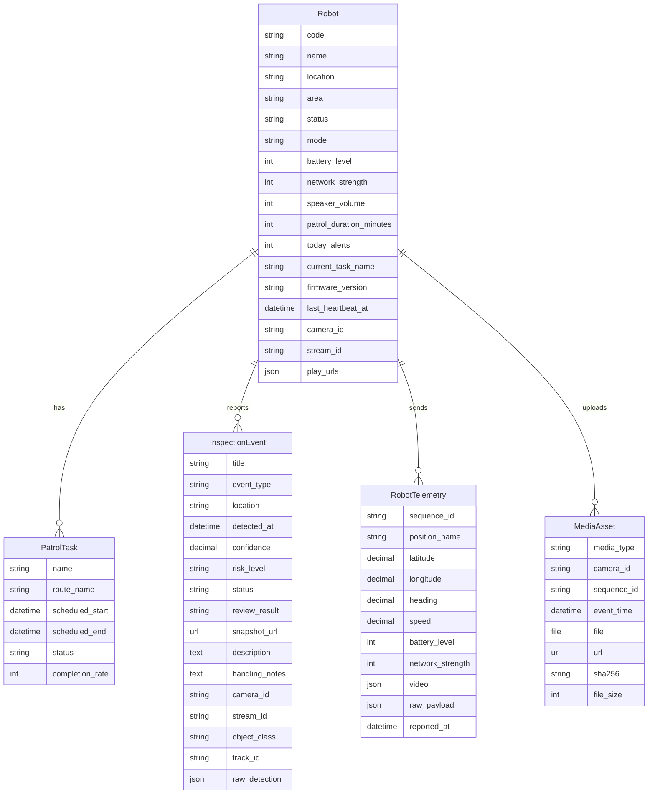

# 数据存储说明

[返回文档中心](./project-docs-index.md)

三端数据架构以
[`docs/architecture/THREE_ENDPOINT_DATA_ARCHITECTURE.md`](../../docs/architecture/THREE_ENDPOINT_DATA_ARCHITECTURE.md)
为准；建库步骤见
[`docs/operation-manual/DATABASE_INITIALIZATION_MANUAL.md`](../../docs/operation-manual/DATABASE_INITIALIZATION_MANUAL.md)。本文补充平台业务字段。

## 1. 存储组成

| 类型 | 位置 | 说明 |
| --- | --- | --- |
| 业务数据库 | `SQLITE_DB_PATH` 或 PostgreSQL 环境变量 | 当前生产为 `/opt/roamerx/shared/db.sqlite3`；Docker 默认为 `runtime/platform/data/backend/db/db.sqlite3` |
| 迁移文件 | `backend/monitoring/migrations/` | 业务表结构版本 |
| 媒体文件 | `backend/media/` | 板端上传的抓拍图/视频片段，以及后端生成的标注图 |
| 前端静态资源 | `frontend/public/`、`frontend/src/` | 演示图片、样式、Vue 组件 |
| 板端本地抓拍 | `bot-version/snapshots/`，由配置决定 | 检测命中后本地保存的抓拍图 |
| 板端上报日志 | `bot-version/data/telemetry/telemetry.jsonl`，由配置决定 | 每次发送给服务端的 JSON 和发送结果 |

## 2. 数据模型总览



所有业务模型继承 `BaseTimestampModel`，包含：

| 字段 | 说明 |
| --- | --- |
| `created_at` | 创建时间 |
| `updated_at` | 更新时间 |

## 3. Robot 机器人表

模型路径：`backend/monitoring/models.py`。

用途：保存机器人基础信息、在线状态、当前运行模式、视频流地址和实时状态快照。

关键字段：

| 字段 | 类型 | 说明 |
| --- | --- | --- |
| `code` | `CharField(unique=True)` | 机器人唯一编号，板端按该字段绑定 |
| `name` | `CharField` | 机器人展示名称 |
| `location` | `CharField` | 当前位置 |
| `area` | `CharField` | 当前巡检区域 |
| `status` | `CharField` | `online`、`offline`、`warning`、`charging` |
| `mode` | `CharField` | `auto`、`manual`、`standby`、`returning` |
| `battery_level` | `PositiveSmallIntegerField` | 电量百分比 |
| `network_strength` | `PositiveSmallIntegerField` | 网络信号强度 |
| `speaker_volume` | `PositiveSmallIntegerField` | 扬声器音量 |
| `patrol_duration_minutes` | `PositiveIntegerField` | 今日巡检时长 |
| `today_alerts` | `PositiveIntegerField` | 今日告警计数 |
| `current_task_name` | `CharField` | 当前任务名称 |
| `firmware_version` | `CharField` | 固件版本 |
| `last_heartbeat_at` | `DateTimeField` | 最近心跳时间 |
| `camera_id` | `CharField` | 当前摄像头编号 |
| `stream_id` | `CharField` | 视频流 ID |
| `play_urls` | `JSONField` | 播放 URL，如 `flv`、`hls` |

写入来源：

- 仅 `ENABLE_DEMO_SEED=true` 或显式使用 `--with-demo-data` 时创建演示机器人。
- `POST /api/telemetry/ingest/` 会按 `robot_code` 创建或更新机器人。

## 4. PatrolTask 巡检任务表

用途：保存巡检任务计划和执行进度。

字段：

| 字段 | 说明 |
| --- | --- |
| `name` | 任务名称 |
| `robot` | 关联机器人 |
| `route_name` | 巡检路线 |
| `scheduled_start` | 计划开始时间 |
| `scheduled_end` | 计划结束时间 |
| `status` | `pending`、`running`、`completed`、`paused` |
| `completion_rate` | 完成度百分比 |

排序：按 `scheduled_start` 倒序。

当前主要由演示数据初始化产生，前端在巡检任务页展示。

## 5. InspectionEvent 识别事件表

用途：保存板端检测命中的异常事件，以及值班人员复核/处置结果。

字段：

| 字段 | 说明 |
| --- | --- |
| `robot` | 事件所属机器人 |
| `title` | 事件标题，通常取检测 `label` |
| `event_type` | 事件编码，例如 `vehicle_illegal_parking` |
| `location` | 事件位置 |
| `detected_at` | 检测发生时间 |
| `confidence` | 置信度，后端保存百分比 |
| `risk_level` | `high`、`medium`、`low` |
| `status` | `pending`、`resolved` |
| `review_result` | `confirmed`、`suspected`、`false_alarm` |
| `snapshot_url` | 原始抓拍图 URL |
| `description` | 事件说明 |
| `handling_notes` | 处置备注 |
| `camera_id` | 摄像头 ID |
| `stream_id` | 视频流 ID |
| `object_class` | 模型识别类别 |
| `track_id` | 跟踪目标 ID |
| `bbox_x/y/width/height` | 检测框坐标 |
| `frame_width/frame_height` | 原始画面尺寸 |
| `raw_detection` | 原始检测 JSON |

写入来源：

- `POST /api/telemetry/ingest/` 中的 `detections[]`。

更新来源：

- `POST /api/events/<event_id>/handle/` 更新 `status`、`handling_notes`、`review_result`。

标注图：

- `EventSerializer` 会计算 `annotated_snapshot_url`。
- 后端会尝试在原图中查找粉色区域或使用存储的 bbox，生成青色框标注图。
- 生成文件保存在 `backend/media/annotated-events/event-<id>.jpg`。

## 6. RobotTelemetry 遥测表

用途：保存每次板端状态上报的完整遥测记录。

字段：

| 字段 | 说明 |
| --- | --- |
| `robot` | 关联机器人 |
| `sequence_id` | 上报流水号，全局唯一 |
| `position_name` | 位置名称 |
| `latitude`、`longitude` | 经纬度 |
| `heading` | 朝向 |
| `speed` | 速度 |
| `battery_level` | 电量 |
| `network_strength` | 网络强度 |
| `video` | 视频相关 JSON |
| `raw_payload` | 原始上报 JSON |
| `reported_at` | 板端上报时间 |

幂等规则：

- `sequence_id` 唯一。
- 若重复上报同一个 `sequence_id`，后端直接返回已有记录 ID，不重复创建遥测和事件。

## 7. MediaAsset 媒体资源表

用途：记录板端上传的抓拍图或视频片段。

字段：

| 字段 | 说明 |
| --- | --- |
| `robot` | 关联机器人 |
| `media_type` | `snapshot` 或 `clip` |
| `camera_id` | 摄像头 ID |
| `sequence_id` | 对应遥测流水号 |
| `event_time` | 事件时间 |
| `file` | Django 文件字段 |
| `url` | 可访问 URL |
| `sha256` | 文件 SHA-256 |
| `file_size` | 文件大小 |

文件路径：

```text
backend/media/device-media/YYYY/MM/DD/<filename>
```

上传流程：

1. 板端检测到事件后本地保存抓拍。
2. 板端向 `/api/device/media/upload/` 发送 multipart 文件。
3. 后端可选校验 SHA-256。
4. 后端保存文件并返回 `url`。
5. 板端把返回的 `url` 写入 detection 的 `snapshot_url`，再随遥测上报。

## 8. 基础配置与演示数据

正式初始化使用：

```bash
python manage.py migrate --noinput
PLATFORM_OPERATOR_PASSWORD='<strong-password>' python manage.py initialize_platform
```

它创建基础播报/告警配置、操作员和机器人，但不创建伪地图、伪路线和伪任务。

函数：`backend/monitoring/views.py` 中的 `ensure_demo_seed()`。

触发时机：

- `ENABLE_DEMO_SEED=true` 时，登录及部分演示接口访问。
- 显式执行 `python manage.py initialize_platform --with-demo-data`。

初始化内容：

- 用户：仅演示环境使用的 `operator`；禁止在生产沿用演示密码。
- 机器人：`ZSL-1A-07`，默认在线，位置为太阳宫公园南入口。
- 任务：`公园主通道早间巡检`。
- 默认视频流：`dog_ZSL-1A-07_front`。

## 9. 数据清理建议

生产环境不要删除整库。MQTT 入站审计表由 `run_patrol_scheduler` 按保留窗口清理：已处理/忽略报文默认 30 天，失败报文 180 天；卡住超过 7 天的 `pending` 行在周任务中标为失败。调度器每小时删除一小批，并在每周一 03:00（`Asia/Shanghai`）循环删除直到没有过期行或达到 10 分钟预算，随后对 SQLite 做 `WAL` checkpoint。手工排空可执行：

```bash
python manage.py prune_inbound_messages --until-done --expire-stale-pending
```

开发演示时可删除：

```text
backend/db.sqlite3
backend/media/
bot-version/data/telemetry/
bot-version/snapshots/
```

删除后需重新执行迁移：

```powershell
cd backend
..\.venv\Scripts\python.exe manage.py migrate
```

注意：删除数据库和媒体文件会清空所有本地业务数据，操作前应确认不需要保留历史记录。
