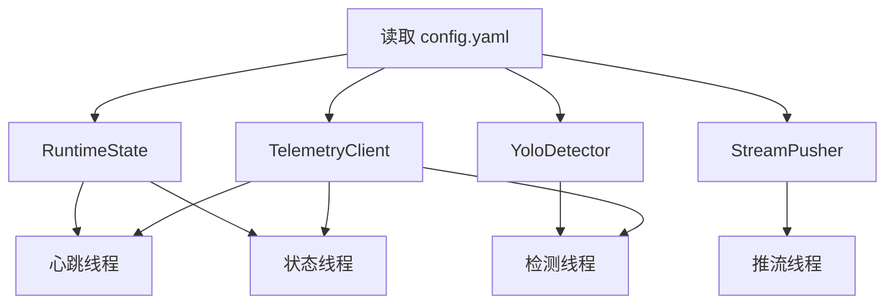
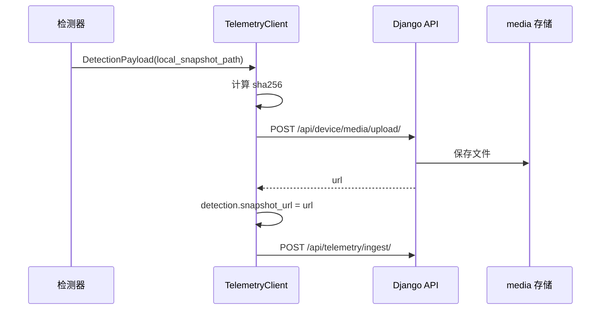

# 板端识别与视频链路

[返回文档中心](./project-docs-index.md)

现场检测帧率、CPU 占用和 CUDA/TensorRT 关系见仓库文档 [YOLO_GPU_INFERENCE_PLAN.md](../../docs/YOLO_GPU_INFERENCE_PLAN.md)，不要在本文件重复维护优化方案。

## 1. 模块目标

`bot-version` 是机器人板端最小可用项目，负责把摄像头/RTSP 源转换为平台可消费的数据：

- 读取摄像头或 RTSP 视频。
- 使用 YOLO 模型检测自行车。
- 对目标进行跟踪和重复告警控制。
- 保存抓拍图。
- 上传抓拍媒体。
- 发送遥测和检测事件 JSON。
- 可选启动 ffmpeg，将 RTSP 推送到 ZLMediaKit。
- 本地记录每次上报 JSON 和发送结果。

## 2. 运行入口

| 入口 | 说明 |
| --- | --- |
| `python run_edge.py --config config.yaml` | 完整入口，启动心跳、状态上报、检测、可选推流 |
| `python run_stream.py --config config.yaml` | 仅启动推流 |
| `python run_demo_server.py` | 演示服务入口，具体以脚本实现为准 |

## 3. 主流程

`src/bike_bot/main.py` 中的 `main()` 会：

1. 读取 YAML 配置。
2. 创建目录。
3. 初始化运行状态、检测器、遥测客户端、推流器。
4. 创建停止事件和错误队列。
5. 启动多线程：
   - `heartbeat-worker`
   - `status-worker`
   - `detection-worker`
   - `zlm-stream-worker`，仅 `stream.enable=true` 时启动
6. 主线程监控错误队列和 Ctrl+C。



## 4. 配置说明

配置模板：`bot-version/config.example.yaml`。

### 4.1 robot

```yaml
robot:
  code: "ZSL-1A-07"
  name: "南入口巡检机器人"
```

- `code`：机器人唯一编号，对应后端 `Robot.code`。
- `name`：展示名称。

### 4.2 location

```yaml
location:
  name: "太阳宫公园南入口"
  latitude: 39.983521
  longitude: 116.447153
```

上报后会写入：

- `Robot.location`
- `Robot.area`
- `RobotTelemetry.position_name`
- `InspectionEvent.location`

### 4.3 video

```yaml
video:
  source: "rtsp://192.168.133.1:8554/test"
  width: 1280
  height: 720
  camera_id: "front"
  stream_id: "dog_ZSL-1A-07_front"
  play_urls:
    flv: "http://127.0.0.1/live/dog_ZSL-1A-07_front.live.flv"
    hls: "http://127.0.0.1/live/dog_ZSL-1A-07_front/hls.m3u8"
  rtsp_transport: "tcp"
  open_timeout_seconds: 8
  read_timeout_seconds: 8
  reconnect_interval_seconds: 3
```

说明：

- `source` 可以是摄像头编号，也可以是 RTSP 地址。
- `stream_id` 和 `play_urls` 会通过遥测上报写入后端，前端用它们播放实时流。
- `rtsp_transport=tcp` 通常更稳定。

### 4.4 stream

```yaml
stream:
  enable: true
  ffmpeg_path: "ffmpeg"
  rtmp_url: "rtmp://<cloud-server-ip>/live/dog_ZSL-1A-07_front"
  reconnect_interval_seconds: 5
  video_codec: "copy"
  audio_enabled: false
  extra_args: []
```

说明：

- `enable=true` 时 `run_edge.py` 会额外启动推流线程。
- `video_codec=copy` 表示尽量不转码，降低 CPU 占用。
- 若源编码不能被 FLV/RTMP 直接封装，可改为 `libx264`。

### 4.5 model

```yaml
model:
  path: "models/bike.onnx"
  backend: "onnxruntime"
  confidence: 0.55
  nms_iou_threshold: 0.45
  image_size: 960
  device: ""
  tensorrt_enabled: true
  tensorrt_fp16: true
  tensorrt_engine_cache_path: data/trt-cache/yolo11n
  classes:
    - "bicycle"
    - "bike"
    - "自行车"
```

说明：

- 现场 `bot-version-test` 默认 `onnxruntime`，优先 `TensorrtExecutionProvider` FP16，失败则回退 CUDA/CPU。
- `tensorrt_enabled: false` 可关掉 TensorRT，不必改代码。
- `device` 只对 Ultralytics 后端有效。
- 检测和直播仍是两条链：直播保持 `video_codec=copy`，检测框不画进 RTMP。
- `classes` 用于筛选目标类别。

### 4.6 detection

```yaml
detection:
  event_type: "vehicle_illegal_parking"
  event_label: "自行车违停"
  risk_level: "medium"
  event_cooldown_seconds: 10
  min_box_area: 4000
  tracking_enabled: true
  tracker_iou_threshold: 0.3
  track_ttl_seconds: 30
  duplicate_alert_seconds: 300
```

说明：

- `event_type` 写入后端 `InspectionEvent.event_type`。
- `event_label` 写入事件标题。
- `min_box_area` 过滤过小目标。
- `tracking_enabled` 开启后可按目标跟踪 ID 去重。
- `duplicate_alert_seconds` 控制同一目标重复告警间隔。

### 4.7 telemetry

```yaml
telemetry:
  endpoint: "http://127.0.0.1:8000/api/telemetry/ingest/"
  media_upload_endpoint: "http://127.0.0.1:8000/api/device/media/upload/"
  timeout_seconds: 5
  verify_tls: false
  device_key: ""
  heartbeat_interval_seconds: 5
  status_interval_seconds: 2
```

说明：

- `endpoint` 接收 JSON 遥测和检测事件。
- `media_upload_endpoint` 接收抓拍文件。
- `device_key` 当前后端未强制校验，生产环境建议启用。

### 4.8 snapshot、display、storage、runtime

```yaml
snapshot:
  directory: "snapshots"
  public_base_url: ""
  jpeg_quality: 90

display:
  enable: true
  window_name: "Bike Bot Detection"
  show_fps: true
  max_width: 1280

storage:
  telemetry_log_path: "data/telemetry/telemetry.jsonl"

runtime:
  mode: "auto"
  status: "online"
  battery_level: 78
  charging: false
  signal_strength: 92
  network_type: "5G"
  speed: 1.26
  heading: 83.50
```

## 5. 遥测与事件生成

`TelemetryClient.build_payload()` 生成 `TelemetryPayload`：

| 数据来源 | 写入字段 |
| --- | --- |
| `config.robot` | `robot_code`、`robot_name` |
| `RuntimeState.snapshot()` | 位置、运动、电量、网络、运行模式 |
| `config.video` | `video.stream_id`、`camera_id`、画面尺寸、播放地址 |
| 检测结果 | `detections[]` |

`TelemetryClient.send()` 会：

1. 构造 payload。
2. 对 detection 中的本地抓拍先调用媒体上传。
3. 将媒体上传返回的 URL 写回 `detection.snapshot_url`。
4. `POST` JSON 到 `telemetry.endpoint`。
5. 成功或失败都写入本地 JSONL 日志。

## 6. 抓拍上传

媒体上传流程：



## 7. 视频推流链路

`StreamPusher` 使用 ffmpeg 命令：

```text
ffmpeg -hide_banner -loglevel warning -rtsp_transport tcp -i <video.source> -an -c:v copy -f flv <stream.rtmp_url>
```

当 `audio_enabled=false` 时会添加 `-an` 去除音频。

当 `video_codec=copy` 时不转码；否则使用配置中的编码器并添加低延迟参数。

ZLMediaKit 接收：

```text
rtmp://<server>/live/dog_ZSL-1A-07_front
```

前端播放：

```text
http://<server>/live/dog_ZSL-1A-07_front.live.flv
http://<server>/live/dog_ZSL-1A-07_front/hls.m3u8
```

## 8. 前端播放兼容策略

前端 `DashboardOverview.vue`：

- 使用 `mpegts.js` 播放 HTTP-FLV。
- 使用 `hls.js` 播放 HLS。
- 销毁旧播放器后再初始化新地址，避免切换流时资源泄漏。
- 组件卸载时销毁播放器。

## 9. 上报频率

当前配置默认：

| 类型 | 默认频率 |
| --- | --- |
| 心跳 | 每 5 秒 |
| 状态 | 每 2 秒 |
| 告警事件 | 命中后实时发送 |
| 同目标重复告警 | 默认 300 秒冷却 |

注意：`heartbeat_worker` 和 `status_worker` 都会调用 `client.send()`，因此在默认配置下即使没有检测事件，也会持续写入遥测记录。

## 10. 部署建议

- 板端优先使用 ONNX + OpenCV DNN，降低依赖重量。
- RTSP 源不稳定时优先使用 TCP。
- 生产环境将 `play_urls` 改成公网可访问域名。
- RTMP 推流地址建议增加鉴权 token。
- 后端应校验 `X-Device-Key` 或签名。
- 大规模部署时 SQLite 应替换为 PostgreSQL/MySQL。
- 媒体文件建议迁移到对象存储或独立文件服务。
